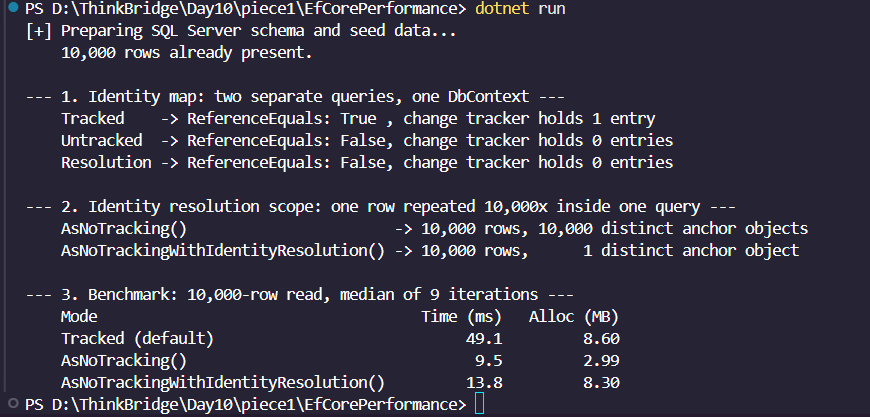

### GitHub link
https://github.com/thinkbridge-thinkschool/thinkschool--PrakharSahu/tree/feature/day10-piece1/Day10/piece1

### Exercise: EF Core change tracker, identity resolution and AsNoTracking

Console app in \EfCorePerformance/\ that runs three things against a real SQL Server:
the identity map, the scope of no-tracking identity resolution, and a timed/allocation
benchmark of a 10,000 row read in all three tracking modes.

#### Setup

Runs against SQL Server 2022 Developer Edition (16.0.4265.3) in a local container, not the
EF InMemory provider. InMemory has no query plan, no network round trip and no relational
materialization pipeline, so it cannot show a tracking cost difference at all.

\\\
docker run -d --name day10-sql -e "ACCEPT_EULA=Y" -e "MSSQL_SA_PASSWORD=<password>" \
  -e "MSSQL_PID=Developer" -p 1433:1433 mcr.microsoft.com/mssql/server:2022-latest
\\\

The connection string is the only sensitive value and it lives in \.env\, which is gitignored.
\ppsettings.json\ holds nothing but the row count and iteration count. Copy \.env.example\
to \.env\, fill in the password, then \dotnet run\. The app creates the schema, seeds 10,000
rows on first run, and reuses them afterwards.

\\\
ConnectionStrings__DefaultConnection="Server=localhost,1433;Database=Day10_DB;User Id=sa;Password=<password>;TrustServerCertificate=True;"
\\\

Tear the container down with \docker rm -f day10-sql\ when finished. Tested on .NET SDK 10.0.302
with EF Core 10.0.11.

#### 1. The identity map

\\\
Tracked    -> ReferenceEquals: True , change tracker holds 1 entry
Untracked  -> ReferenceEquals: False, change tracker holds 0 entries
Resolution -> ReferenceEquals: False, change tracker holds 0 entries
\\\

Two separate \First(r => r.Id == 1)\ calls on the same \DbContext\. The tracked pair comes back
as the same object because the change tracker already had that key in its identity map and
returned what it was holding rather than building a new instance.

Worth being precise about what is and is not being skipped here. This is not query caching. Both
tracked queries really did execute against SQL Server, and EF threw away the second set of
materialized column values in favour of the entity it was already tracking. Checking
\sys.dm_exec_query_stats\ after clearing the plan cache shows the single-row query shape with
\execution_count = 6\, which is exactly the six single-row reads this section performs (two
tracked, two untracked, two with identity resolution). Nothing was served without a round trip.
\DbSet.Find()\ is the method that actually can skip the query, because it checks the identity map
before going to the database, and that is a different behaviour from what a LINQ query does.

\AsNoTracking()\ has no map to consult, so it builds a fresh object each time and the tracker
stays empty.

#### 2. Identity resolution is scoped to one query, not to the context

This is the bit I had backwards at first. \AsNoTrackingWithIdentityResolution()\ does not behave
like the identity map above. That is the third line of the section 1 output: run the exact same
two-query test through it and it still prints \False\, because it only de-duplicates while a
single query is being materialized. To actually see it work, every row is cross joined against
the one row with \Id = 1\, so that row appears 10,000 times in one result set:

\\\csharp
_context.Records.SelectMany(
    row => _context.Records.Where(anchor => anchor.Id == 1),
    (row, anchor) => new { Row = row, Anchor = anchor });
\\\

| Query | Rows | Distinct anchor object references |
|---|---|---|
| \AsNoTracking()\ | 10,000 | 10,000 |
| \AsNoTrackingWithIdentityResolution()\ | 10,000 | 1 |

Plain \AsNoTracking()\ built 10,000 separate objects for what is one database row. That is the
real world problem it solves: a join or an \Include\ with fan-out where the same parent row
repeats across every child row.

#### 3. Benchmark: 10,000 row read

Each mode gets a discarded warm-up pass first (so JIT, the connection pool handshake and the
SQL Server plan cache are already paid for), then 9 timed iterations, each on its own fresh
\DbContext\ so the previous iteration's tracked entities cannot inflate the next one. Reported
figure is the median of the 9. Allocation is process-wide \GC.GetTotalAllocatedBytes(precise: true)\
rather than the per-thread counter, since ADO.NET does some of its allocating off the calling thread.

| Mode | Time (ms) | Allocated (MB) | vs tracked |
|---|---|---|---|
| Tracked (default) | 52.9 | 8.60 | baseline |
| \AsNoTracking()\ | 14.8 | 2.99 | ~4x faster, 2.9x less memory |
| \AsNoTrackingWithIdentityResolution()\ | 12.0 | 8.30 | ~4x faster, same memory |

Full output is in \enchmark-output.txt\. I started at 5 iterations and the timings were all over
the place (the identity resolution row swung between 18 and 78 ms). Going to 9 iterations settled
it down a lot, and across repeated runs the medians now land in a tight band: tracked 50-53 ms,
\AsNoTracking()\ 9-15 ms, identity resolution 12-12.3 ms. The allocation figures were byte for byte
identical on every single run, so those are the numbers I trust most.

So the read path win for \AsNoTracking()\ on a read-only 10,000 row query is roughly **3.5x to 5x
faster and 2.9x less memory**, depending on the run.

The two no-tracking rows should be read as tied on time, not ranked. Their ranges overlap (9-15 ms
against 12-12.3 ms) and in the run above identity resolution happens to come out slightly ahead,
which is noise rather than a real ordering. What matters is that both are far off the tracked
baseline while only one of them gets the memory back:

- the **time** cost of tracking is mostly change detection and snapshotting. Dropping just that,
  and keeping the identity bookkeeping, already takes 52.9 ms down to about 12 ms.
- the **memory** cost of tracking is mostly the identity bookkeeping. That only comes back once
  the bookkeeping goes too, 8.30 MB down to 2.99 MB.

I would not have been able to tell those two costs apart with only the tracked vs \AsNoTracking()\
comparison, which is the main reason I added the third mode.

### What did you learn this session?
The main thing is that "no tracking" is not one setting, it is two, and they cost different things.
Plain \AsNoTracking()\ skips both the change detection snapshot and the per-entity identity
bookkeeping. \AsNoTrackingWithIdentityResolution()\ only skips the first. Having both in the same
benchmark is what let me see that the time cost and the memory cost of tracking come from two
different places, which I would have just guessed at otherwise.

Practically that means identity resolution is close to free on time but not on memory, so you pick
it when you need object de-duplication for correctness on a fan-out query, and you pick plain
\AsNoTracking()\ when you want the allocations back.

I also learned to be careful about what "identity resolution" means. I assumed it was the same
guarantee as the tracked identity map and would hold across separate queries on the same context.
It does not. It is scoped to a single query's materialization, and the only way to demonstrate it
is to make one query return the same row many times.

### What would break this?
Calling \SaveChanges()\ after either no-tracking read. Neither one attaches anything to the
context, so mutations to the returned objects are silently dropped, with no exception to tell
you. That is the dangerous failure mode because it looks like it worked.

The subtler one is carrying the section 1 assumption into section 2's API. If code relies on
\ReferenceEquals\ holding for the same row across two separate
\AsNoTrackingWithIdentityResolution()\ queries, it is relying on a guarantee that does not exist,
and it would work fine in a test using a tracked context and then break in production.

The benchmark itself would also stop being meaningful if the fresh-context-per-iteration or the
warm-up pass were removed. Reusing one context lets tracked entities pile up and makes tracking
look worse than it is, and dropping the warm-up charges the first mode measured for JIT and the
connection handshake.
