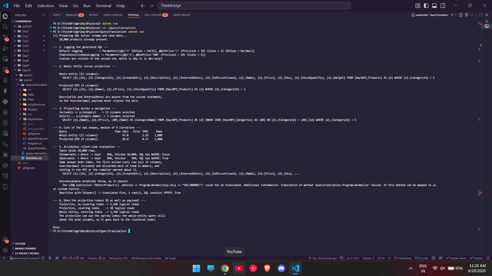

### GitHub link
https://github.com/thinkbridge-thinkschool/thinkschool--PrakharSahu/tree/feature/day10-piece2/Day10/piece2

### Exercise: Query translation and projections

Console app in `QueryTranslation/` that logs the SQL EF Core actually sends, rewrites a
whole-entity query into a DTO projection and measures what that saves, and catches accidental
client-side evaluation in both of the forms it takes.

#### Setup

Same local SQL Server 2022 Developer Edition container as piece 1, but its own database
(`Day10_Piece2_DB`) and its own tables (`Day10P2_Products`, `Day10P2_Categories`).

```
docker run -d --name day10-sql -e "ACCEPT_EULA=Y" -e "MSSQL_SA_PASSWORD=<password>" \
  -e "MSSQL_PID=Developer" -p 1433:1433 mcr.microsoft.com/mssql/server:2022-latest
```

The connection string is the only sensitive value and it lives in `.env`, which is gitignored.
Copy `.env.example` to `.env`, fill in the password, then `dotnet run`. The app creates the
schema and seeds 10,000 products across 10 categories on first run.

`Product` is deliberately wide: 11 columns, two of which (`Description`, `InternalNotes`) are
`nvarchar(max)` carrying about a kilobyte each. Those are the columns a listing screen never
renders, and they are what makes the projection worth measuring instead of just describing.
Full console output is in `query-translation-output.txt`.



#### 1. Logging the generated SQL

`LogTo` is the whole story for a console app. No DI, no logging provider, just a callback,
filtered to the command category so the model-building noise stays out:

```csharp
new DbContextOptionsBuilder<AppDbContext>()
    .UseSqlServer(connectionString)
    .LogTo(capture.Log, new[] { DbLoggerCategory.Database.Command.Name }, LogLevel.Information)
    .EnableSensitiveDataLogging();   // development only
```

`EnableSensitiveDataLogging` is the switch that decides whether parameter values reach the log.
Same query, run twice, with and without it:

```
Default logging            -> Parameters=[@p='?', @minPrice='?' (Precision = 18) (Scale = 2)]
EnableSensitiveDataLogging -> Parameters=[@p='1', @minPrice='500' (Precision = 18) (Scale = 2)]
```

That is the reason it is dev-only. The redacted form is what you want anywhere a log is shipped
or retained, because parameter values are the part that carries customer data.

One thing I got wrong while building this: I first wrote the filter value as `const decimal
minPrice = 500m` and no parameter showed up at all. A `const` gets inlined by the compiler, so
EF sees a literal and emits `Price > 500.0` directly into the SQL. It has to be a variable for
EF to parameterize it. Worth knowing, because inlined literals mean a new query plan per distinct
value instead of one reusable parameterized plan.

#### 2. Whole entity rewritten as a projection

Same filter, same 1,000 rows, two different statements. This is the rewrite the exercise asks for:

```csharp
// before
context.Products.Where(p => p.CategoryId == 1).ToList();

// after
context.Products.Where(p => p.CategoryId == 1)
    .Select(p => new ProductListItemDto
    {
        Id = p.Id, Name = p.Name, Price = p.Price, StockQuantity = p.StockQuantity,
    })
    .ToList();
```

What EF sent, logged rather than assumed:

```sql
-- whole entity, 11 columns
SELECT [d].[Id], [d].[CategoryId], [d].[CreatedUtc], [d].[Description], [d].[InternalNotes],
       [d].[IsDiscontinued], [d].[Name], [d].[Price], [d].[Sku], [d].[StockQuantity], [d].[Weight]
FROM [Day10P2_Products] AS [d] WHERE [d].[CategoryId] = 1

-- projected DTO, 4 columns
SELECT [d].[Id], [d].[Name], [d].[Price], [d].[StockQuantity]
FROM [Day10P2_Products] AS [d] WHERE [d].[CategoryId] = 1
```

`Description` and `InternalNotes` are simply gone from the second statement, so the
`nvarchar(max)` payload never crosses the wire.

#### 3. Projecting across a navigation

A projection that reaches through `p.Category.Name` compiles into an `INNER JOIN` and still only
selects what was named. `Include` is the alternative and it brings back both entities whole:

| Query | Columns selected |
|---|---|
| `.Include(p => p.Category)` | 13 |
| `.Select(p => new ProductWithCategoryDto { ... CategoryName = p.Category!.Name })` | 3 |

```sql
SELECT [d].[Name], [d].[Price], [d0].[Name] AS [CategoryName]
FROM [Day10P2_Products] AS [d]
INNER JOIN [Day10P2_Categories] AS [d0] ON [d].[CategoryId] = [d0].[Id]
WHERE [d].[CategoryId] = 1
```

So a projection is not only about pruning columns on one table, it also replaces `Include` for
read paths. You get the join without dragging back either entity in full.

#### 4. What the rewrite costs

Warm-up pass discarded first, then 9 timed iterations on a fresh `DbContext` each, median
reported. Allocation is process-wide `GC.GetTotalAllocatedBytes(precise: true)`.

| Query | Time (ms) | Allocated (MB) | Rows |
|---|---|---|---|
| Whole entity (11 columns) | 46.0 | 2.35 | 1,000 |
| Projected DTO (4 columns) | 9.4 | 0.37 | 1,000 |

Across four runs the whole-entity query landed in 40-54 ms and the projection in 8-9.4 ms, and
both allocation figures were byte for byte identical every single time. So the projection is
roughly **5x faster and 6.4x less memory** for the same 1,000 rows.

#### 5. Accidental client-side evaluation

There are two kinds and only one of them tells you.

**The silent one.** A repository that hands back `IEnumerable<Product>` instead of
`IQueryable<Product>`. One word in the return type, and a caller's `.Where()` binds to
`Enumerable.Where` rather than `Queryable.Where`:

```csharp
public IEnumerable<Product> GetAllAsEnumerable() => _context.Products.AsNoTracking();  // trap
public IQueryable<Product>  GetAllAsQueryable()  => _context.Products.AsNoTracking();  // fine
```

```
Table holds 10,000 rows.
IEnumerable + Where -> kept    960, fetched 10,000, SQL has WHERE: False
IQueryable  + Where -> kept    960, fetched    960, SQL has WHERE: True
```

Both return the same 960 products. The first one fetched all 10,000 rows, all 11 columns,
`nvarchar(max)` included, and threw away 90% of them in memory. The logged SQL has no `WHERE`
clause at all, which is the only visible evidence. It compiles, it passes tests, it is correct,
and it scales terribly. This is the one I would actually hit in real code.

**The loud one.** A predicate calling a C# method EF cannot translate. Since EF Core 3.0 this is
an exception rather than a silent fallback:

```csharp
private static string Normalize(string sku) => sku.Trim().ToUpperInvariant();
context.Products.Where(p => Normalize(p.Sku) == "SKU-000001").ToList();
```

```
The LINQ expression 'DbSet<Product>().Where(p => Program.Normalize(p.Sku) == "SKU-000001")'
could not be translated. Additional information: Translation of method
'QueryTranslation.Program.Normalize' failed.
```

Rewriting it with something that maps to a SQL function translates fine, and the logged SQL
contains `UPPER`:

```csharp
context.Products.Where(p => p.Sku.ToUpper() == "SKU-000001")
```

The EF Core 3.0 change that made this throw was the right call. The old behaviour silently
degraded into the first failure mode above.

#### 6. Does the projection reduce IO as well as payload?

I wanted to check whether "only fetches the needed columns" also means less disk work, so I
measured actual logical reads from `sys.dm_exec_query_stats`, clearing the plan cache between
runs.

| Query | Logical reads |
|---|---|
| Projection, no covering index | 3,348 |
| Projection, with covering index on `(CategoryId) INCLUDE (Name, Price, StockQuantity)` | 10 |
| Whole entity, with that same index available | 3,348 |

So the answer is no, not on its own. Without a covering index the projection reads exactly the
same 3,348 pages as the whole-entity query, because the rows still live in the clustered index
and the engine has to visit those pages regardless of how few columns the SELECT list names. The
saving is real but it is in network payload and materialization, which is what section 4 measured.

Add an index that covers the projected columns and the projection drops to 10 reads, while the
whole-entity query stays at 3,348 because it still needs the wide columns the index does not
include. The projection and the index are what make each other worth having.

### What did you learn this session?
The thing that actually changed how I would write this code is that a projection and an index are
two halves of one optimisation. I assumed `Select` into a DTO was the whole win. Measuring logical
reads showed the projection alone does not touch IO at all, and the covering index alone would not
help a query that still asks for `nvarchar(max)` columns. 3,348 reads down to 10 needed both.

The `IEnumerable` versus `IQueryable` trap is the one I will actually watch for. It is a single
word in a method signature, it produces correct results, and the only symptom is a missing `WHERE`
in a log nobody is reading. Getting into the habit of keeping repository return types as
`IQueryable` until the query is genuinely finished is cheaper than finding this later.

I also learned that logging the SQL is not optional for this kind of work. Every claim in this
README came from a logged statement or a DMV reading, and two of the things I expected going in
(the `const` inlining, and projections reducing IO) turned out to be wrong.

### What would break this?
Returning `IQueryable` from a repository fixes the client-side evaluation trap but opens a
different one: the `DbContext` has to still be alive when the query is finally enumerated. Hand an
`IQueryable` out past the scope of its context and it throws `ObjectDisposedException` at
enumeration time, somewhere far away from the code that caused it.

The covering index is not free either. It is a second copy of those columns that every insert and
update to `Day10P2_Products` has to maintain, which is the same write-side cost trade-off from
Day 8. Worth it for a hot read path, not worth it applied everywhere.

The projection also quietly gives up change tracking, since a DTO is not an entity. That is what
you want on a read path, but if someone later needs to mutate and save one of these rows they
cannot do it through the DTO, and reaching for the whole entity again undoes the saving.

Section 6's numbers depend on clearing the plan cache between measurements. Without that, SQL
Server reuses the plan and the logical read figures reflect whichever query shape warmed the
cache first, which would make the comparison meaningless.
