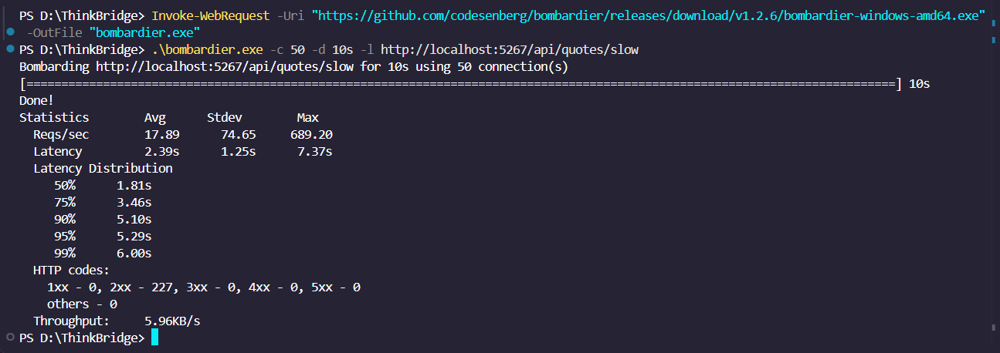

# Day 11 — Profile a Slow Endpoint

## Objective
The objective of this exercise is to intentionally engineer data-access anti-patterns within the Week-1 API and profile the resulting performance degradation. By introducing an N+1 query problem and removing a critical database index, we can establish a performance baseline, capture the emitted SQL, and analyze the database execution plan.

---

## 1. Baseline Profiling (p50 / p99)
To capture the performance baseline under load, the endpoint was tested using `bombardier`, simulating 50 concurrent connections over a 10-second duration.

*   **p50 (Median Latency):** 1.81s
*   **p99 (99th Percentile Latency):** 6.00s
*   **Max Latency:** 7.37s
*   **Throughput:** 17.89 Reqs/sec

**Proof of Load Test Execution:**


---

## 2. The Offending SQL (N+1 Anti-Pattern)
By enabling Entity Framework Core database command logging (`Microsoft.EntityFrameworkCore.Database.Command: Information`), the exact SQL emitted by the application was captured. The logs reveal a severe N+1 query issue.

**The "1" Query (Parent):**
The application first retrieves all `User` records in a single database round-trip.
```sql
SELECT "u"."Id", "u"."Email", "u"."PasswordHash"
FROM "Users" AS "u"