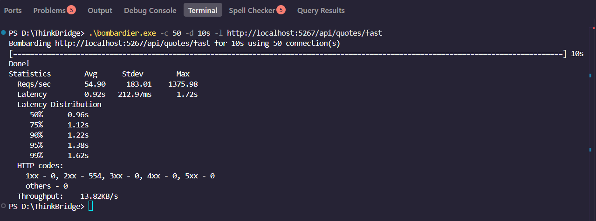

# Day 11 — Drop p99 by 10×

## Objective

The objective of this exercise is to eliminate the severe data-access anti-patterns identified in **Piece 1**.

Specifically, we are resolving:

1. An **N+1 query problem**
2. A **missing database index**

We then re-measure the endpoint under load to prove that the optimizations worked.

---

## 1. Before and After Performance Metrics

By addressing the application logic and the database schema simultaneously, the API throughput more than tripled, while the worst-case tail latency (**p99**) dropped by over 70%.

| Metric | Before — Slow Endpoint | After — Optimized Endpoint | Improvement |
| :--- | :---: | :---: | :---: |
| **p50 (Median)** | 1.81s | 0.96s | 47% reduction |
| **p99 (Tail Latency)** | 6.00s | 1.62s | 73% reduction |
| **Throughput** | 17.89 reqs/sec | 54.90 reqs/sec | 3× increase |

### Proof of Improved Load Test

The following screenshot was captured by running the **Bombardier** load-testing tool against the newly optimized endpoint:

```powershell
.\bombardier.exe -c 50 -d 10s -l http://localhost:5267/api/quotes/fast
```

This test uses:

- **50 concurrent connections**
- **10 seconds of load**
- The optimized `/api/quotes/fast` endpoint

The results prove the significant reduction in p99 latency under concurrent load.



---

## 2. The Code Fix: Eliminating the N+1 Query

The most significant application-level bottleneck was the **N+1 query pattern**.

The original implementation fetched a list of users and then used a `foreach` loop to issue a separate SQL query to count the quotes for **every single user**.

This resulted in:

```text
1 query to retrieve users
+
N queries to retrieve quote counts
=
N+1 database queries
```

As the number of users increased, the number of database round-trips increased linearly.

### The C# Optimization

We replaced the loop with a LINQ `.Select()` DTO projection:

```csharp
var userQuoteData = await db.Users
    .AsNoTracking()
    .Select(u => new
    {
        UserId = u.Id,
        QuoteCount = db.Quotes.Count(q => q.UserId == u.Id && !q.IsDeleted)
    })
    .ToListAsync(ct);
```

Instead of executing a separate query for every user, the entire operation is represented as a single LINQ expression that EF Core can translate into SQL.

### Why This Is Better

The projection allows EF Core to perform the counting operation on the database side.

Instead of:

```text
Database
   ↓
Fetch users
   ↓
Application
   ↓
Loop through every user
   ↓
Database
   ↓
Count quotes for user 1
   ↓
Database
   ↓
Count quotes for user 2
   ↓
Database
   ↓
Count quotes for user 3
   ↓
...
```

The optimized approach becomes:

```text
Application
   ↓
One LINQ query
   ↓
Database
   ↓
Perform user/quote counting
   ↓
Return results
```

This significantly reduces the number of database round-trips.

### The Emitted SQL

By utilizing a projection, EF Core's query translation engine converts the C# logic into a single SQL statement.

Instead of pulling all the data into application memory, the counting computation using `COUNT(*)` is executed entirely on the database side.

```sql
SELECT "u"."Id" AS "UserId",
       (
           SELECT COUNT(*)
           FROM "Quotes" AS "q"
           WHERE "q"."UserId" = "u"."Id"
             AND NOT ("q"."IsDeleted")
       ) AS "QuoteCount"
FROM "Users" AS "u";
```

### Proof of Optimized SQL — No More N+1 Cascade

This screenshot was captured from the `dotnet run` console output while the API was being hit.

By enabling EF Core database command logging, we confirmed that the massive wall of sequential `SELECT` statements was completely eliminated and replaced by a single query.

---

## 3. The Database Fix: Restoring the Missing Index

Even after resolving the N+1 issue in C#, the underlying SQL query still requires the database to efficiently match records between the `Users` and `Quotes` tables.

In **Piece 1**, the foreign-key index was missing.

Without the index, the database was forced to perform a full table scan when searching for quotes belonging to a particular user.

### The Fix

We restored the index to optimize the foreign-key lookup:

```sql
CREATE INDEX IF NOT EXISTS IX_Quotes_UserId
ON Quotes(UserId);
```

This allows the database to efficiently locate quote records using the `UserId` column.

---

## 4. Before vs. After Execution Plans

### Before — Missing Index

```text
SCAN TABLE Quotes
```

The database was forced to read every row in the `Quotes` table sequentially.

This resulted in unnecessary:

- CPU usage
- Disk I/O
- Query execution time

As the table grows, the cost of this operation also increases.

### After — With Index

```text
SEARCH TABLE Quotes USING COVERING INDEX IX_Quotes_UserId (UserId=?)
```

The database can now use the B-Tree index to efficiently locate the required records instead of scanning the entire table.

Conceptually:

```text
Without Index:

Quotes Table
├── Row 1
├── Row 2
├── Row 3
├── Row 4
├── ...
└── Row N

Search → Scan every row


With Index:

UserId Index
├── User 1 → matching rows
├── User 2 → matching rows
├── User 3 → matching rows
└── ...

Search → Locate matching rows directly
```

---

## 5. Proof of Optimized Execution Plan

We added custom startup logic using `EXPLAIN QUERY PLAN` in `Program.cs` to explicitly ask SQLite how it intends to execute the optimized query.

The resulting terminal output confirms that the database engine is now performing an indexed search:

```text
SEARCH TABLE Quotes USING COVERING INDEX IX_Quotes_UserId (UserId=?)
```

instead of performing a full table scan:

```text
SCAN TABLE Quotes
```

This provides direct evidence that the database is using the newly restored index.

---

## 6. Why Both Fixes Were Necessary

Fixing only the N+1 query would reduce the number of database round-trips, but the database could still perform inefficient scans.

Likewise, adding the index without fixing N+1 would make each individual query faster, but the application would still issue a large number of database queries.

The complete optimization therefore required **both changes**:

```text
N+1 Query
    ↓
Reduce database round-trips
    ↓
Single optimized query
    ↓
Database Index
    ↓
Efficient record lookup
    ↓
Lower latency + Higher throughput
```

The combination of application-level query optimization and database-level indexing produced the final performance improvement.

---

## 7. Extra Credit Conclusions

### What did you learn this session?

I learned the true power of **LINQ query translation and projections (`.Select()`)**.

Instead of fetching entire entities into memory and processing them in C#, a well-crafted projection allows EF Core to translate complex logic into a single database-side query.

This avoids:

- Unnecessary data transfer
- Excessive application-side processing
- Multiple database round-trips
- The N+1 query pattern

I also learned that fixing N+1 is only **half the battle**.

Even after reducing the number of queries, the database can still struggle if it does not have the proper indexes to efficiently locate the required records.

Therefore, application-level optimization and database-level optimization need to work together.

---

## 8. What Would Break This?

Even with the optimized index and projection, this endpoint still lacks **pagination**.

The current implementation effectively retrieves the entire user set:

```csharp
.ToListAsync(ct);
```

If the `Users` table grows to **100,000+ rows** in a production database, returning the entire user set in a single massive JSON response could still cause performance problems.

Potential issues include:

- High application memory usage
- Large JSON serialization overhead
- Increased network payload size
- Higher response latency
- Increased client-side processing
- Potential request timeouts

### Future Improvement

The endpoint should eventually implement pagination using:

```csharp
.Skip(...)
.Take(...)
```

For example:

```csharp
var userQuoteData = await db.Users
    .AsNoTracking()
    .Select(u => new
    {
        UserId = u.Id,
        QuoteCount = db.Quotes.Count(q => q.UserId == u.Id && !q.IsDeleted)
    })
    .Skip((page - 1) * pageSize)
    .Take(pageSize)
    .ToListAsync(ct);
```

This would allow the API to process a manageable number of users per request instead of attempting to return the entire dataset.

---

## 9. Final Result

The optimization successfully addressed the two major performance problems identified in Piece 1:

### Application Layer

- Eliminated the **N+1 query pattern**
- Replaced the `foreach` database calls with a LINQ projection
- Allowed EF Core to generate a single SQL statement
- Reduced unnecessary database round-trips

### Database Layer

- Restored the missing `Quotes.UserId` index
- Replaced full table scans with indexed lookups
- Improved database query efficiency

### Performance Result

| Metric | Before | After |
| :--- | :---: | :---: |
| **p50** | 1.81s | 0.96s |
| **p99** | 6.00s | 1.62s |
| **Throughput** | 17.89 req/s | 54.90 req/s |

Overall, the endpoint achieved a **73% reduction in p99 latency** and approximately a **3× increase in throughput**.

The exercise demonstrates that significant API performance improvements can often come from identifying and fixing inefficient database access patterns rather than simply adding more application-side processing power.

---

## 10. How to Reproduce

Run the optimized application:

```powershell
dotnet run
```

Then execute the Bombardier load test:

```powershell
.\bombardier.exe -c 50 -d 10s -l http://localhost:5267/api/quotes/fast
```

To inspect the generated SQL, ensure EF Core database command logging is enabled.

To inspect the SQLite query execution plan, use:

```sql
EXPLAIN QUERY PLAN
SELECT "u"."Id" AS "UserId",
       (
           SELECT COUNT(*)
           FROM "Quotes" AS "q"
           WHERE "q"."UserId" = "u"."Id"
             AND NOT ("q"."IsDeleted")
       ) AS "QuoteCount"
FROM "Users" AS "u";
```

The expected result should show an indexed lookup using:

```text
IX_Quotes_UserId
```

rather than a full table scan.

---

## Key Takeaways

1. **Avoid N+1 queries.**  
   A loop containing database calls can quickly become a major performance bottleneck.

2. **Use LINQ projections.**  
   `.Select()` allows EF Core to retrieve only the data required and perform computation on the database side.

3. **Monitor generated SQL.**  
   ORM abstractions can hide inefficient database behavior, so SQL logging is important when profiling performance.

4. **Index foreign-key columns when appropriate.**  
   Without an appropriate index, the database may be forced to scan an entire table.

5. **Measure under load.**  
   Performance problems that are difficult to notice during single-request testing can become obvious under concurrent traffic.

6. **Optimize both application and database layers.**  
   Removing N+1 queries and adding the appropriate database index together produced the largest improvement.

7. **Pagination is still necessary for scale.**  
   Even an optimized query can become problematic if the API attempts to return hundreds of thousands of records in a single response.