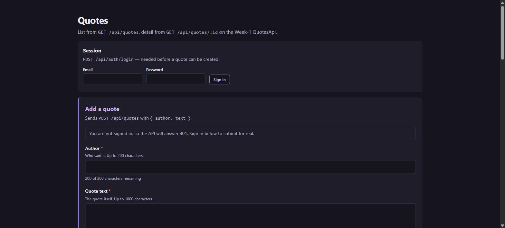
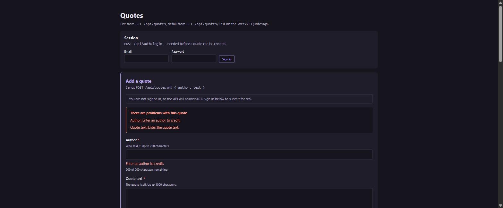
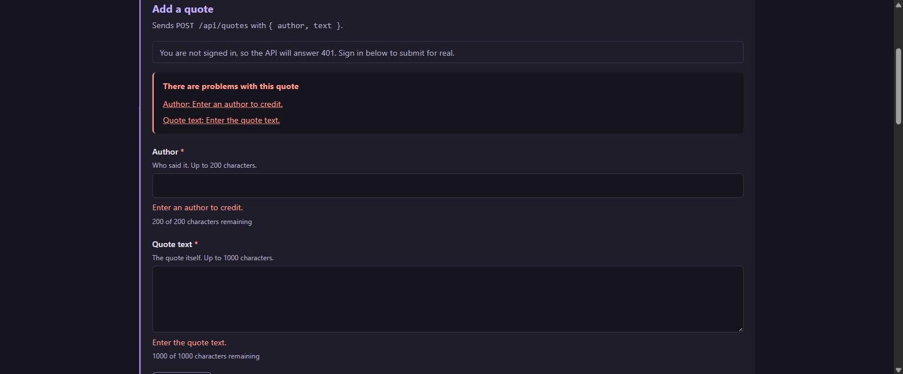
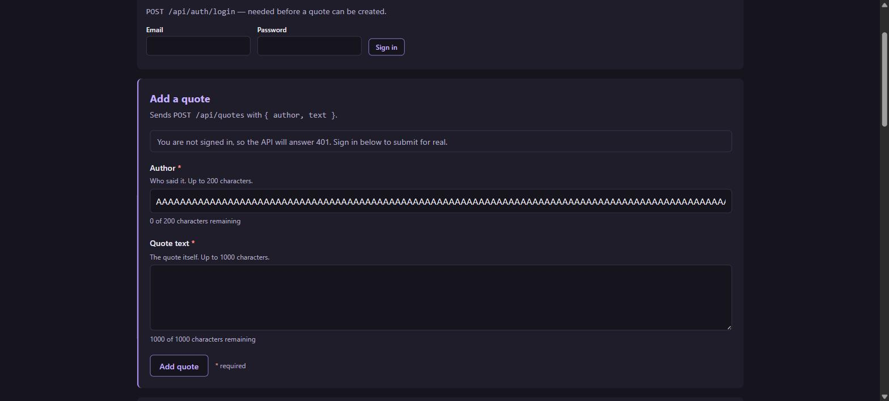
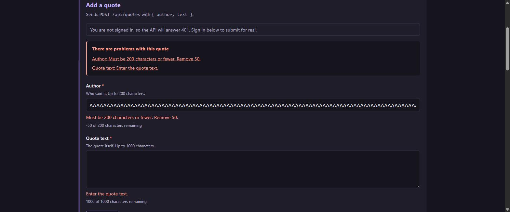
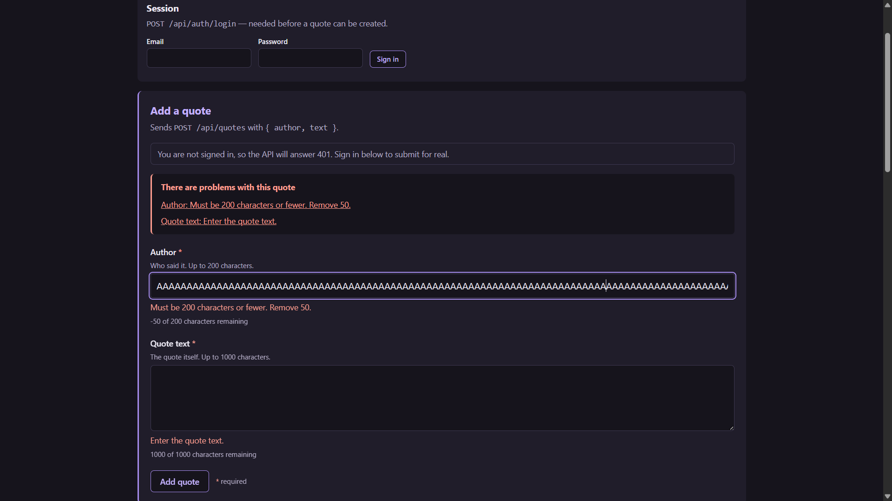
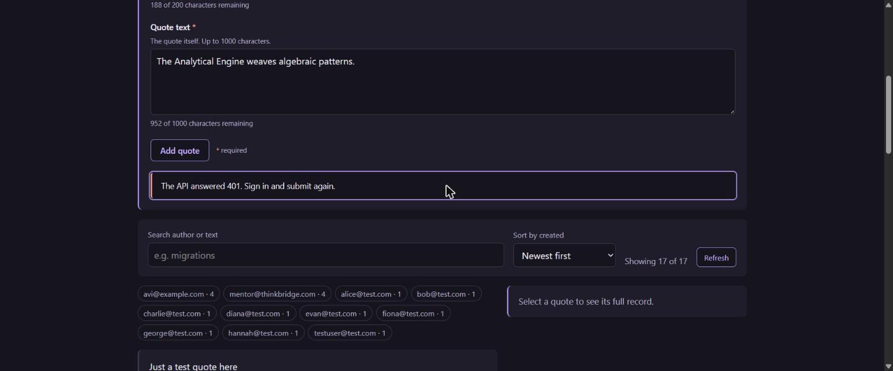

# Day 14 / Piece 1 — Reactive forms + accessibility

An accessible **create-a-quote** form built with **Angular 21 Signal Forms**, posting to the real
Week-1 QuotesApi. Extends the list + detail app from `Day13/piece2`.

**Stack:** Angular 21.2 (zoneless, standalone) · Signal Forms (`@angular/forms/signals`, experimental)
· Tailwind CSS v4 · Vitest · axe-core

The full brief, agent output and verification log are in [`exercise.txt`](./exercise.txt).

---

## The API contract this form is built against

Everything below is read from the server, not guessed.

| | |
|---|---|
| Endpoint | `POST /api/quotes` — `QuoteEndpointExtensions.cs:26` |
| Host | `http://localhost:5267` |
| Body | `CreateQuoteRequest(string Author, string Text)` → `{ "author": "...", "text": "..." }` |
| Rules | `Quote.Create` — `Models/Quote.cs:27` |
| | `author` — not null/whitespace, `Length <= 200` (`Quote.cs:32`) |
| | `text` — not null/whitespace, `Length <= 1000` (`Quote.cs:29`) |
| Responses | `201` + created Quote · `400` + `{"message":"..."}` · `401` no token · `403` missing scope |
| Auth | `RequireAuthorization("can-edit-quotes")` — bearer token from `POST /api/auth/login` |

Exactly two fields are sent. `id`, `createdAt`, `isDeleted` and `userId` are assigned server-side.

---

## Running it

```bash
# 1. the Week-1 API
cd Day5/piece6/QuotesApi
dotnet run --launch-profile http          # http://localhost:5267

# 2. this app  (proxies /api → :5267, since the API sends no CORS headers)
cd Day14/piece1/quotes-web
npm install
npm start                                 # http://localhost:4200
```

```bash
npm test        # 115 tests, 11 files — includes axe assertions
ng build        # production build
```

### Signing in

`POST /api/quotes` is guarded, so the form needs a token. The API seeds an account on first run
**only when the `Users` table is empty**, so point it at a fresh database rather than deleting yours:

```bash
Seed__AdminEmail='you@example.local' \
Seed__AdminPassword='<pick your own>' \
ConnectionStrings__DefaultConnection='Data Source=../../../Day14/piece1/quotes-dev.db' \
dotnet run --launch-profile http
```

Then sign in through the **Session** panel at the top of the page; the
`accessTokenInterceptor` attaches the token to every subsequent write.

> **The 201 path needs a one-line server fix.** `can-edit-quotes` requires
> `RequireClaim("scope","quotes.write")` (`InfrastructureExtensions.cs:141`), but `GenerateJwt` only
> mints `sub` and `email` (`AuthEndpoints.cs:33`) — so every token the API issues is rejected by its
> own write endpoint with a **403**. Add the third claim to fix it:
>
> ```csharp
> new Claim("scope", "quotes.write")
> ```

---

## Screenshots

### The form



Session panel and form together:



### Invalid state

Submitting empty reports both fields — in an error summary and inline — and moves focus to the first
invalid control. Each problem is listed **once**:



### The defect that mattered: silent truncation

**Before.** `maxLength()` in the schema also stamps a native `maxlength` attribute. Pasting 250
characters into the 200-limit field left 200 behind — 50 destroyed, no error, no `aria-invalid`,
nothing announced. The counter even reads as if the user landed exactly on the limit:



**After.** Validating length by hand keeps the attribute off, so the value is kept, the counter goes
negative, and the error is announced and linked via `aria-describedby`:



The same state, reproduced by hand afterwards:



### Server error

A real `401` from the API, rendered in a `role="alert"` region with focus moved onto it:



---

## Accessibility

| Requirement | How |
|---|---|
| Associated labels | explicit `<label for>` per control; no placeholder-as-label |
| Invalid controls | `aria-invalid="true"` only once errors are shown |
| Error association | `aria-describedby` lists the error id **first**, and only ids actually in the DOM |
| Focus on submit | `focusBoundControl()` on the first invalid field, in DOM order |
| Error summary | `role="alert"`, with `<button>`s that focus their field (not `href="#id"`) |
| Keyboard | native controls, visible `:focus-visible` ring, no positive tabindex, Enter submits |
| Busy state | `aria-disabled` on submit — never `disabled`, which drops it from the tab order |
| Live regions | `role="alert"` for failures (focus moves), `role="status"` for success (focus stays) |
| Counter | in `aria-describedby`; only announced within 20 characters of the limit |

Verified with **axe-core**: zero violations in jsdom (2 assertions in the component spec) and zero in
Chrome with contrast checks enabled, on both the empty and error-displaying states. The keyboard path
was walked with real Tab presses recorded via a `focusin` listener.

---

## Layout

```
src/app/
├── core/
│   ├── auth/            access-token.store · access-token.interceptor · auth-api.client
│   │   └── ui/sign-in-panel/
│   ├── config/          QUOTES_API_BASE_URL token
│   ├── http/            HttpErrorResponse → sentence
│   └── storage/
└── features/quotes/
    ├── domain/          create-quote.ts (limits, isBlank, serverLengthOf) · quote.ts
    ├── data-access/     create-quote.client.ts (POST) · quotes-api.client · quote-detail-api.client
    ├── state/           create-quote.schema · create-quote-store · quotes-store · quote-detail-store
    └── ui/              quote-form · quote-list · quote-detail · quote-filters · quotes-page
```

`domain` is Angular-free and holds the API's rules. `data-access` owns URLs and nothing else.
`state` owns signals. `ui` takes inputs — only `quotes-page` knows the stores exist.

---

## Defects caught during review

1. **Silent truncation** — `maxLength()` stamped a native `maxlength`; 50 pasted characters were
   discarded with nothing announced, and the validator was unreachable dead code.
2. **Duplicate announcement** — `required()` and the whitespace check both fired on an empty field,
   so the same sentence was listed twice.
3. **Focus that did nothing** — the error alert renders inside an `@switch` arm that only becomes
   active during the submit handler, so `viewChild()` was empty and `.focus()` silently no-opped.

All three are fixed and pinned by regression tests. Details in [`exercise.txt`](./exercise.txt).
