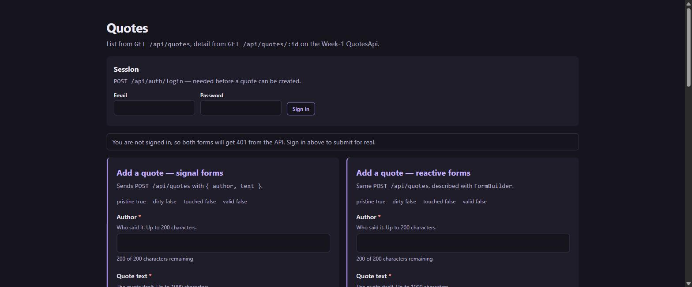
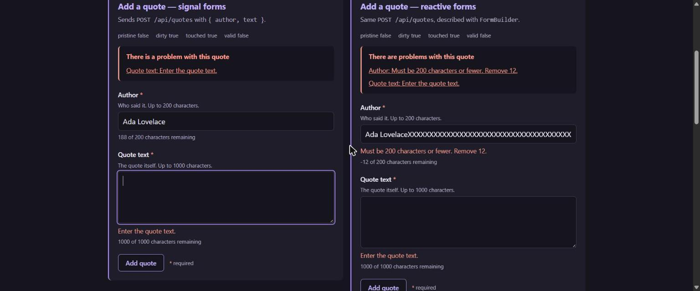
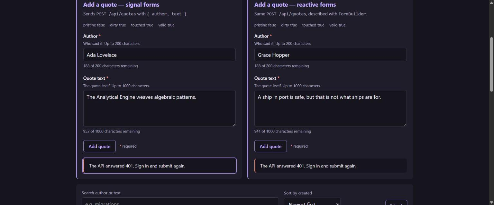
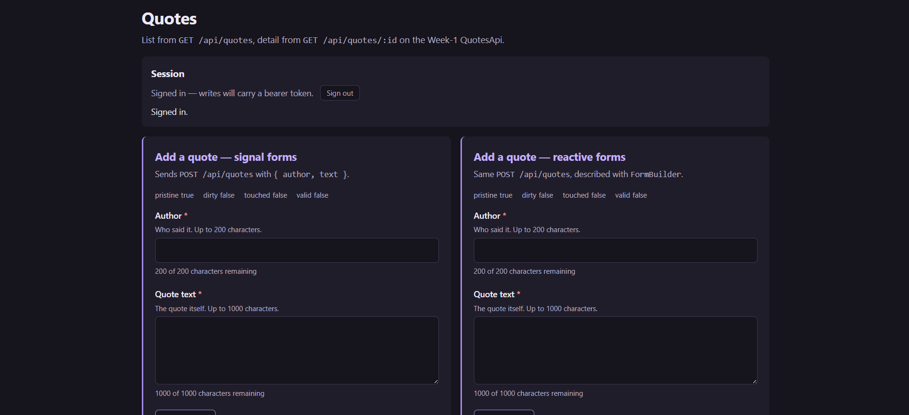

# Day 14 / Piece 2 — Signal Forms preview, compared

The **same create-a-quote form described twice** — once with **Signal Forms**
(`@angular/forms/signals`) and once with **`ReactiveFormsModule`** — rendered side by side against the
real Week-1 QuotesApi, so the comparison points at two working implementations instead of describing
one from memory.

Extends `Day14/piece1`, which was the Signal Forms build on its own.

**Stack:** Angular 21.2 (zoneless, standalone) · Signal Forms (experimental) · ReactiveFormsModule
· Tailwind CSS v4 · Vitest · axe-core

The brief, the agent output, the full verification log and the comparison are in
[`exercise.txt`](./exercise.txt).

---

## Why two forms

Everything after *“the form is valid”* — sending the request and mapping the five possible outcomes —
lives in one shared `QuoteSubmission` service that both stores inject. So the diff between
`create-quote-store.ts` and `create-quote-reactive-store.ts` **is** the comparison: there is nowhere to
hide a fake difference, and neither API gets credit for something both do.

| | Signal Forms | Reactive forms |
|---|---|---|
| Model | `signal()` + `schema()` | `FormGroup` of `FormControl`s |
| Reading state (zoneless) | already signals | needs `toSignal(form.events)` bridge |
| `pristine` | absent — derive `!dirty()` | `form.pristine` |
| Error messages | carried on the error object | rebuilt from error keys |
| Focus a control | `focusBoundControl()` | no equivalent — component must find the element |
| Mark all touched on submit | `submit()` does it | `markAllAsTouched()` by hand |
| `reset()` | clears touched/dirty **only** — value survives | clears value *and* state |
| Max length | `maxLength()` also stamps native `maxlength` | `Validators.maxLength` is validation-only |
| Maturity | `@experimental 21.0.0` | stable |

---

## The API contract both forms are built against

| | |
|---|---|
| Endpoint | `POST /api/quotes` — `QuoteEndpointExtensions.cs:26` |
| Body | `CreateQuoteRequest(string Author, string Text)` → `{ "author": "...", "text": "..." }` |
| Rules | `author` — not null/whitespace, `Length <= 200` (`Quote.cs:32`) |
| | `text` — not null/whitespace, `Length <= 1000` (`Quote.cs:29`) |
| Responses | `201` + created Quote · `400` + `{"message":"..."}` · `401` · `403` |
| Auth | `RequireAuthorization("can-edit-quotes")` |

---

## Running it

```bash
cd Day5/piece6/QuotesApi && dotnet run --launch-profile http    # :5267
cd Day14/piece2/quotes-web && npm install && npm start          # :4200, /api proxied
npm test                                                        # 142 tests, 12 files
```

> **The 201 path needs a one-line server fix.** `can-edit-quotes` requires
> `RequireClaim("scope","quotes.write")` (`InfrastructureExtensions.cs:141`) but `GenerateJwt` only mints
> `sub` and `email` (`AuthEndpoints.cs:33`), so every token the API issues is rejected by its own write
> endpoint with a 403. Add `new Claim("scope", "quotes.write")` to fix it.

---

## Screenshots

Both forms, identical initial state — `pristine true · dirty false · touched false · valid false` on each:



After a failed submit. Same state read-outs, same messages, same one-`<li>`-per-problem summary; the
reactive side is also showing the over-length error with a negative counter:



A real `401` from the API, reported character-for-character the same by both:



---



## What the comparison actually found

- **They match everywhere I could measure.** Pristine, dirty, touched, valid, every validator, clean
  submit, failed submit — identical across both, verified in a real browser, not asserted.
- **`reset()` does not reset.** Probed directly: it clears `touched` and `dirty` and leaves both the
  field value and the model at their old values. The `model.set(...)` in `resetForm()` is load-bearing.
- **Two defects caught reading the diff** — `document.getElementById` leaking into the reactive store
  (a real hazard with two forms on one page), and a dead `errors['server']` branch promising inline
  field errors the API cannot supply, since its 400 body carries no field name.

Details, reproductions and the full verdict are in [`exercise.txt`](./exercise.txt).
