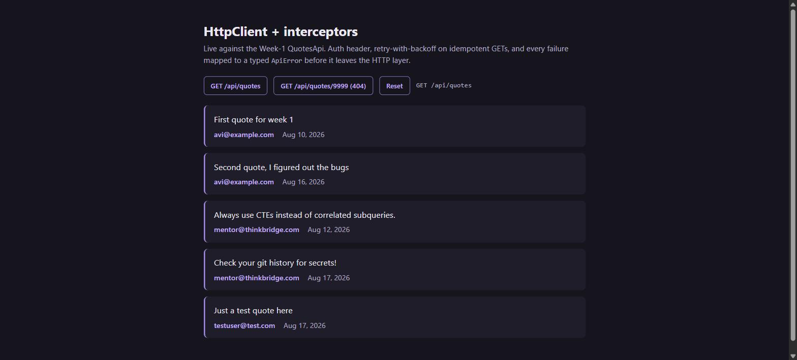
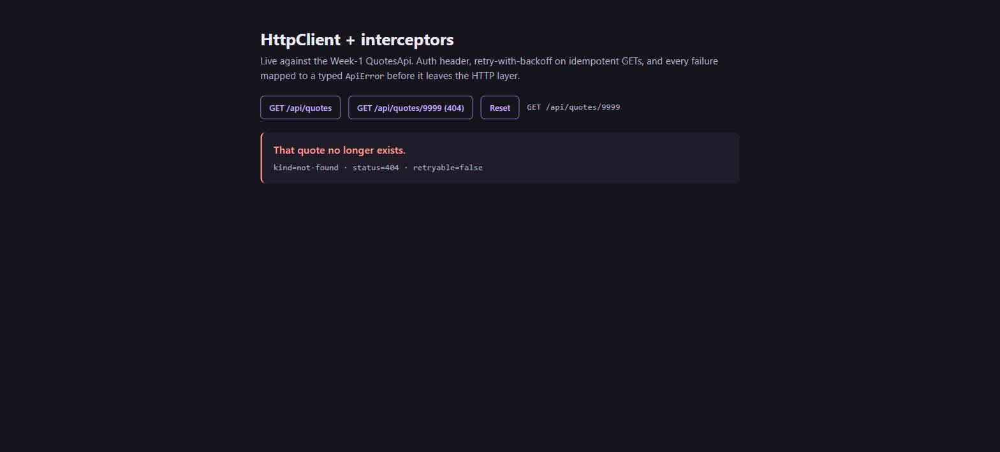
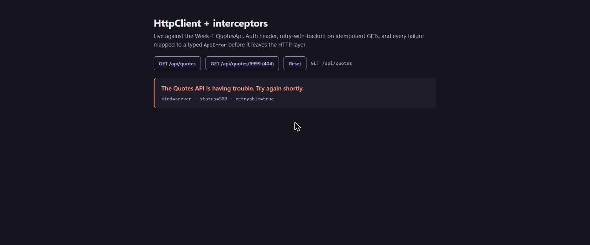

# Day 15 — HttpClient + interceptors

The HTTP layer for the Week-1 QuotesApi: a **characterization test that pins the real contract**,
then three **functional interceptors** built against what that test found — an auth header,
retry-with-backoff on idempotent GETs, and every failure mapped to a typed `ApiError`.

**Stack:** Angular 21.2 (zoneless, standalone) · `HttpInterceptorFn` · Vitest

Brief, agent output and the full verification log are in [`exercise.txt`](./exercise.txt).

---

## The characterization test came first — and the brief was wrong

The task described `GET /api/quotes?page=N&size=N` returning `{id, author, text}`, with 4xx as
ProblemDetails. Recorded against the running server, all three are false:

| Assumption | What the server actually does |
|---|---|
| `?page=N&size=N` pages | **Ignored.** `?page=1&size=2` returns all 5 rows, identical to no params |
| `{id, author, text}` | **Six fields** — plus `createdAt`, `isDeleted`, `userId` (it returns the EF entity) |
| 4xx is ProblemDetails | **Never.** `AddProblemDetails()` is not called; 4xx bodies are empty, or a `text/plain` .NET stack trace |

That inverted the error mapper's design: a hard-coded sentence per status is the *primary* path, and
ProblemDetails is optional enrichment used only if it ever appears. Written as briefed, every 401, 403
and 404 would have rendered a **blank** message.

Recordings live in [`src/app/contract/week1-api.recorded.ts`](./src/app/contract/week1-api.recorded.ts)
and are pinned by [`week1-api.contract.spec.ts`](./src/app/contract/week1-api.contract.spec.ts) — 16
tests, green before any UI existed.

---

## The interceptor chain

```ts
export const HTTP_INTERCEPTOR_CHAIN = [
  authHeaderInterceptor,        // outermost: stamps the token once, before anything replays
  errorMappingInterceptor,      // middle:    maps what finally fails, after retries are exhausted
  retryIdempotentInterceptor,   // innermost: re-issues the request, sees raw HttpErrorResponses
];
```

Angular builds `[A, B, C]` as `A(B(C(backend)))`, so **the last entry is closest to the network**.
Retry has to be last — put the mapper after it and retry receives an already-mapped `ApiError`,
`instanceof HttpErrorResponse` is false, and nothing is ever retried while everything still compiles
and looks correct. `interceptor-order.spec.ts` asserts the shipped chain retries three times and keeps
the broken order as a regression guard asserting it retries **zero**.

| Interceptor | Rules |
|---|---|
| **auth header** | Bearer from an in-memory store, read per request; never to `/auth/login` or `/auth/refresh`; never overwrites a caller's header |
| **retry** | `GET`/`HEAD`/`OPTIONS` only — a replayed `POST /api/quotes` creates a second quote and there is no idempotency key. Retries `0, 408, 429, 5xx`; never a 4xx the server understood. Exponential backoff with **full jitter**, honours `Retry-After` |
| **error mapping** | `HttpErrorResponse` → `ApiError { kind, status, friendlyMessage, fieldErrors, traceId, retryable }`. A `text/plain` body **never** becomes a message |

---

## Running it

```bash
cd Day5/piece6/QuotesApi && dotnet run --launch-profile http   # :5267
cd Day15/quotes-web && npm install && npm start                # :4200, /api proxied
npm test                                                        # 67 tests, 6 files
```

---

## Screenshots

Live list from the real API — five quotes, real authors, offset timestamps:



`GET /api/quotes/9999`. The server returns a **completely empty body**, so every word here came from the
mapper — and the network panel shows **exactly one** request, because a 404 is not retried:



The API killed mid-session. One click produced **three** GET requests and then one sentence — no status
code, no stack trace:



---

## What the store looks like as a result

```ts
async load(): Promise<void> {
  await this.run('GET /api/quotes', async () => {
    const quotes = await this.api.listQuotes();
    this.state.set({ status: quotes.length === 0 ? 'empty' : 'ready', quotes, error: null, ... });
  });
}
```

No status codes, no response bodies, no idea a retry happened. That is the return on the interceptor
layer — the error handling that remains is `catch (e) { if (e instanceof ApiError) show(e.friendlyMessage) }`.

---

## Known gaps

- The recordings are hand-captured and dated; **nothing re-runs curl against the server in CI**, so a
  contract change is only caught the next time someone re-records.
- Retry has no circuit breaker or global budget — several failing GETs each spend three attempts.
- `Retry-After` is honoured **without a ceiling**; a `Retry-After: 3600` would hang the request for an hour.
- The write path is unreachable end to end: `can-edit-quotes` needs a `quotes.write` scope that
  `AuthEndpoints.cs:33` never mints, so a valid token still gets 403.
