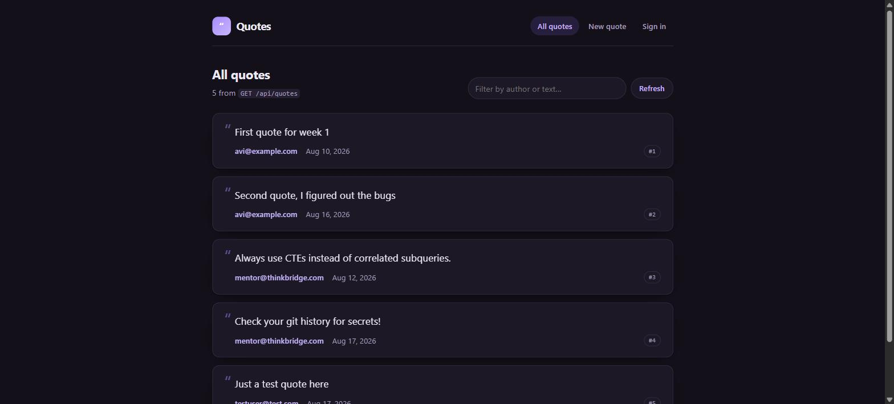
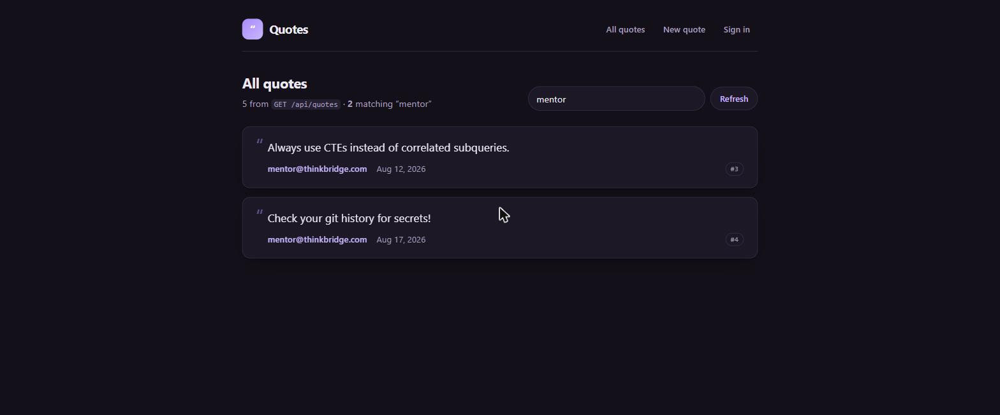
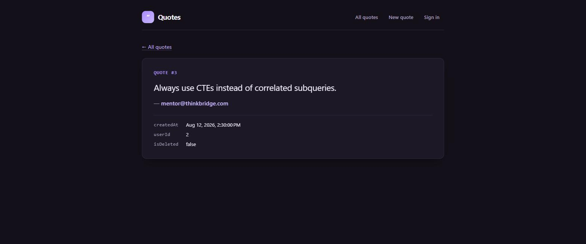
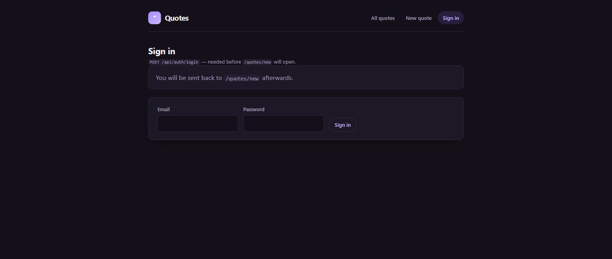
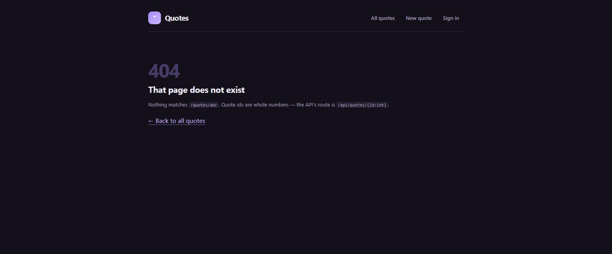

# Day 16 / Piece 1 — Routing, lazy loading, guards

Lazy-loaded routes, a feature-owned child route table, functional guards, resolved page titles, URL-driven
list state, and a **View Transition** between list and detail — against the real Week-1 QuotesApi.
Builds on Day 15's HTTP layer.

**Stack:** Angular 21.2 (zoneless, standalone) · `loadChildren` + `loadComponent` · `CanActivateFn` /
`CanMatchFn` / `ResolveFn` · `withViewTransitions()` · Vitest

Brief, agent output and verification log: [`exercise.txt`](./exercise.txt).

---

## Route table

The root config knows about the shell and mounts the feature; the feature owns its own children.

```ts
// app.routes.ts
{ path: 'quotes', loadChildren: () => import('./features/quotes/quotes.routes').then(m => m.quotesRoutes) }
```

| Path | Chunk | Guard / resolver |
|---|---|---|
| `/quotes?q=` | `quotes-page` 5.29 kB | — (`GET /api/quotes` is anonymous) |
| `/quotes/new` | `new-quote-page` 1.08 kB | `canActivate: authGuard` — targets `POST /api/quotes` |
| `/quotes/:id` | `quote-detail-page` 3.50 kB | `canMatch: quoteIdMustBeInteger` · `title: quoteTitle` |
| `/sign-in` | `sign-in-page` 3.34 kB | — |
| `**` | `not-found-page` 668 B | renders in place, no `redirectTo` |

Plus `quotes-routes` 662 B — the feature's route table is itself a chunk.

**Three decisions worth defending:**

- **Order.** `quotes/new` precedes `quotes/:id`; the router matches top-down and `:id` happily matches the
  literal `new`. Swapped, the create page 404s. Pinned by a test.
- **`canMatch`, not `canActivate`, for the id.** `false` means *this route does not match*, so the url
  falls through to the wildcard. `canActivate: false` merely cancels and strands the user.
- **No `redirectTo` on the wildcard.** Rendering in place keeps the bad address visible — the page prints
  it back so the typo is findable.

---

## Where the guard goes — and where it doesn't

`GET /api/quotes` and `GET /api/quotes/{id}` carry **no** `.RequireAuthorization()`
(`QuoteEndpointExtensions.cs:20`, `:23`). Guarding the detail route would refuse users data the server
hands to anyone. The guard sits only on `/quotes/new` → `POST /api/quotes` → `can-edit-quotes`.
A test asserts signing out leaves list and detail reachable.

```ts
export const authGuard: CanActivateFn = (_route, state): boolean | UrlTree => {
  const tokens = inject(AccessTokenStore);
  const router = inject(Router);
  if (tokens.isSignedIn()) return true;
  return router.createUrlTree(['/sign-in'], { queryParams: { returnUrl: state.url } });
};
```

---

## The filter lives in the URL

`/quotes?q=mentor` is shareable, survives a reload, and is part of history. The row link uses
`queryParamsHandling="preserve"`, so the detail url carries it and **Back returns you to the same
filtered list** rather than the top of an unfiltered one. Verified end to end:

```
filtered      /quotes?q=mentor     2 of 5 rows   title "Quotes"
opened #3     /quotes/3?q=mentor                 title "Quote #3 · Quotes"
clicked Back  /quotes?q=mentor     2 rows, filter box still "mentor"
```

---

## Screenshots

| | |
|---|---|
|  |  |
| List route | Filter written to `?q=` |
|  |  |
| Detail — chunk arrives on first navigation | Guard redirect, `returnUrl` preserved |
|  | |
| `/quotes/abc` → not-found, url kept, no request | |

Navigating to `/quotes/3` with the log cleared:

```
GET /chunk-W74S7OKG.js                                        200   ← detail chunk, first time
GET /@ng/component?c=…quote-detail-page.ts@QuoteDetailPage    200
GET /api/quotes/3                                             200
```

---

## Running it

```bash
cd Day5/piece6/QuotesApi && dotnet run --launch-profile http   # :5267
cd Day16/piece1/quotes-web && npm install && npm start         # :4200, /api proxied
npm test                                                        # 80 tests, 6 files
```

---

## Known gaps

- The id rule duplicates the server's `{id:int}`; two places must agree, one is tested against the API.
- No preloading strategy — deliberate, since it is what makes the lazy-load verification visible.
- The filter runs client-side because `GET /api/quotes` takes no query parameters. Fine at five rows.
- `returnUrl` is checked for a leading single slash only, not validated against the route table.
- The View Transition is unverifiable in a test; the paired `view-transition-name` is asserted, but
  nothing proves the animation ran.
