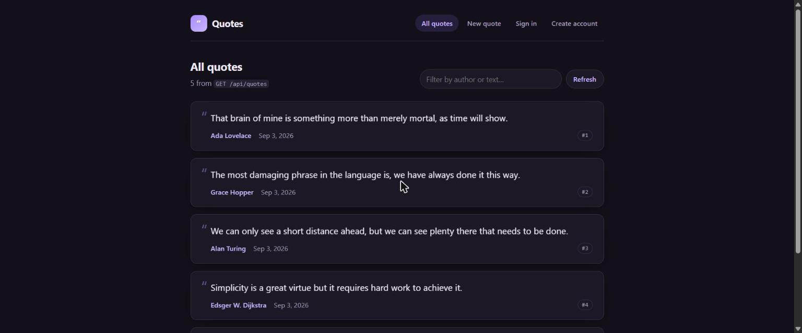
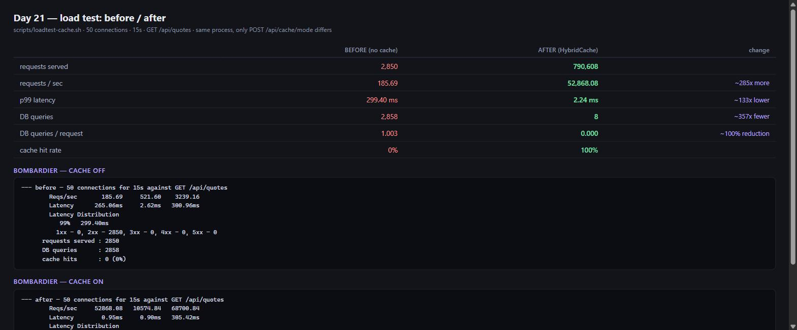
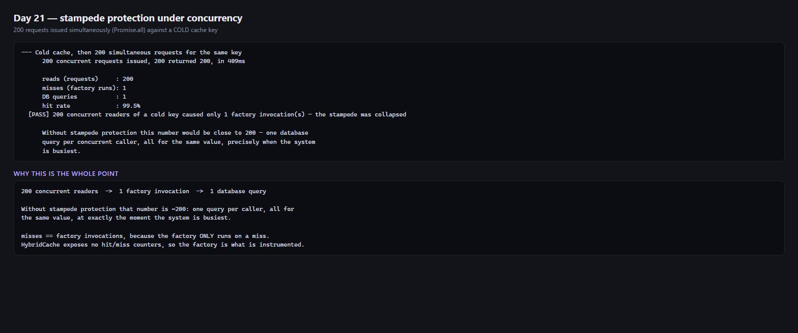
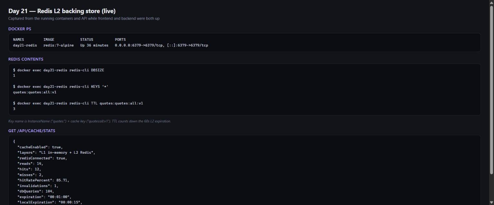
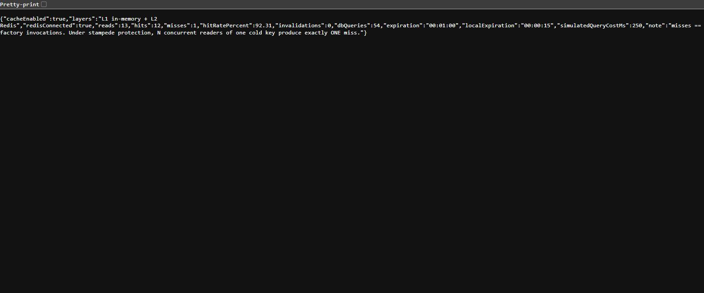

# Day 21 — HybridCache + stampede protection

HybridCache (L1 in-memory + L2 Redis) over the hot read, with stampede protection, and a load
test that measures the difference.

**Deliverable:** [EXERCISE.md](EXERCISE.md) — cache wiring, before/after, stampede proof.
**Change-by-change walkthrough:** [update_code.md](update_code.md) — every file and method I
touched, and why.

Built on Day 20. **Days 17-20 are unchanged.**

## Headline

| | BEFORE | AFTER |
|---|---:|---:|
| requests/sec | 185.69 | **52,868.08** |
| p99 latency | 299.40 ms | **2.24 ms** |
| DB queries | 2,858 | **8** |
| hit rate | 0% | **100%** |

**200 concurrent readers of a cold key -> 1 database query.**

Full output: [`docs/loadtest-results.txt`](docs/loadtest-results.txt).

## What changed

```
backend/
  Caching/
    CachedQuoteReader.cs      <- GetOrCreateAsync: the cache AND the stampede protection
    CacheOptions.cs           <- mutable singleton, so the load test can flip caching at runtime
    CacheMetrics.cs           <- reads / factory invocations -> hit rate
  Data/DbQueryCounter.cs      <- EF interceptor: the "DB queries" number
  Endpoints/CacheEndpoints.cs <- stats, reset, mode, invalidate
  Extensions/
    CachingExtensions.cs      <- AddHybridCache + Redis as L2
    QuoteEndpointExtensions.cs<- GET /api/quotes now reads through the cache; 3 invalidation sites
    InfrastructureExtensions.cs<- DbContext gains the query-counting interceptor
scripts/loadtest-cache.sh     <- before/after + stampede
```

## Endpoints

| Method | Route | Purpose |
|---|---|---|
| `GET` | `/api/cache/stats` | reads, hits, misses, hit rate, **dbQueries**, layers |
| `POST` | `/api/cache/reset` | zero counters and drop the entry |
| `POST` | `/api/cache/mode` | switch caching on/off at runtime. **Development only** |
| `POST` | `/api/cache/invalidate` | drop the entry, keep the counters |

## Running it

```bash
# Redis (optional - without it HybridCache runs L1-only)
docker run -d --name day21-redis -p 6379:6379 redis:7-alpine

# The measurement
cd Day21 && bash scripts/loadtest-cache.sh

# Backend + frontend together
cd backend && ConnectionStrings__Redis=localhost:6379   Jwt__Key="$(openssl rand -base64 48)" dotnet run     # :5267
cd frontend && npm start                                # :4200, proxies /api -> :5267
```

## Screenshots

All captured from a live run with Redis, the backend and the Angular dev server all up.
The three report cards are rendered from the real output files (`docs/loadtest-results.txt`,
`docker ps`, `redis-cli`) rather than being terminal photos — the underlying text is unedited.

### The app, served through the cache



`ng serve` on :4200 proxying `/api` to the backend on :5267. The header reads
**"5 from `GET /api/quotes`"** — that response came from the cache, and the six-field contract is
unchanged, so Day 16's `isQuote()` guard accepts it exactly as it accepted the uncached one.

### Load test — before / after



Same process, same endpoint, same request; only `POST /api/cache/mode` differs between the two
arms. **185.69 -> 52,868.08 req/s**, **p99 299.40 ms -> 2.24 ms**, **2,858 -> 8 DB queries**.

### Stampede protection



200 requests issued simultaneously via `Promise.all` against a **cold** key:
**200 reads -> 1 factory invocation -> 1 database query.** Without stampede protection that
number is ~200.

### Redis as L2, live



The `day21-redis` container, the actual cached key in Redis (`quotes:quotes:all:v1` — the
`InstanceName` prefix plus the cache key) with its TTL counting down the 60s L2 expiration, and
`GET /api/cache/stats` reporting `"layers": "L1 in-memory + L2 Redis"`.

> Worth knowing: if you check Redis and see `DBSIZE 0`, that is usually not a bug — the L2 entry
> expires after 60s, so an idle system legitimately has an empty Redis while L1 and the app carry
> on working. I hit exactly that while capturing these and had to force a miss to confirm L2 was
> really being written.

### Raw stats endpoint



## Verified

| Check | Result |
|---|---|
| Backend build | OK |
| `QuotesApi.Outbox.Tests` | 8/8 |
| `QuotesApi.Messaging.Tests` | 7/7 |
| `QuotesApi.Jobs.Tests` | 8/8 |
| Frontend `ng test` | 147/147 |
| Both running together | `ng serve` :4200 proxying to :5267 |
| Cached response contract | all six fields, `createdAt` still `+00:00` |
| Load test | 3/3 |

## Configuration

```json
"Cache": {
  "Enabled": true,
  "Expiration": "00:01:00",          // L2 (Redis)
  "LocalExpiration": "00:00:15",     // L1 - the cross-replica staleness window
  "SimulatedQueryCost": "00:00:00.250"
}
```

Redis comes from `ConnectionStrings:Redis`, supplied at runtime and never committed. Empty means
L1-only rather than an error.

`SimulatedQueryCost` is an artificial delay inside the factory. Without it a 5-row SQLite query
returns too fast for concurrent callers to overlap, and a stampede would not be observable at all.
