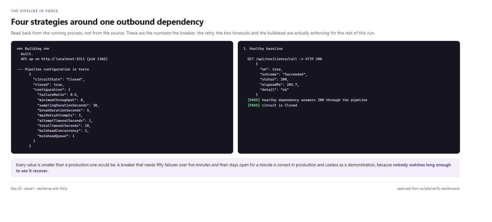
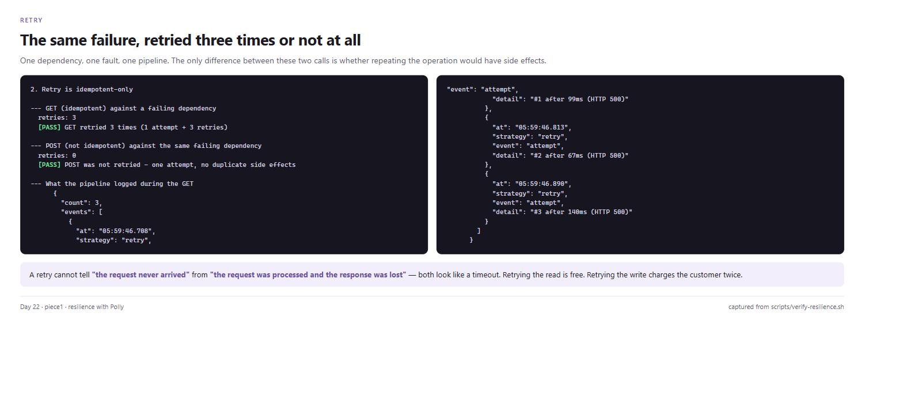
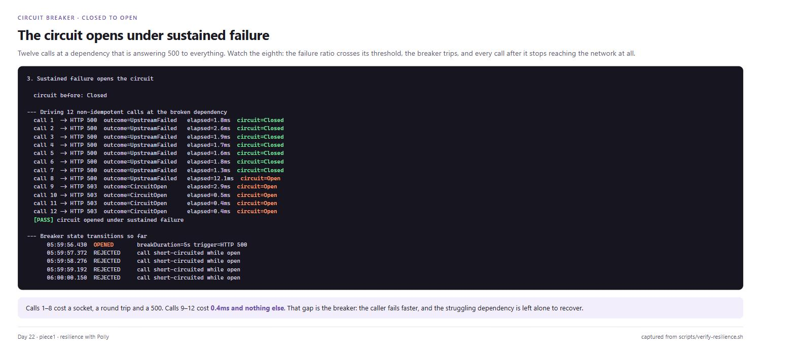
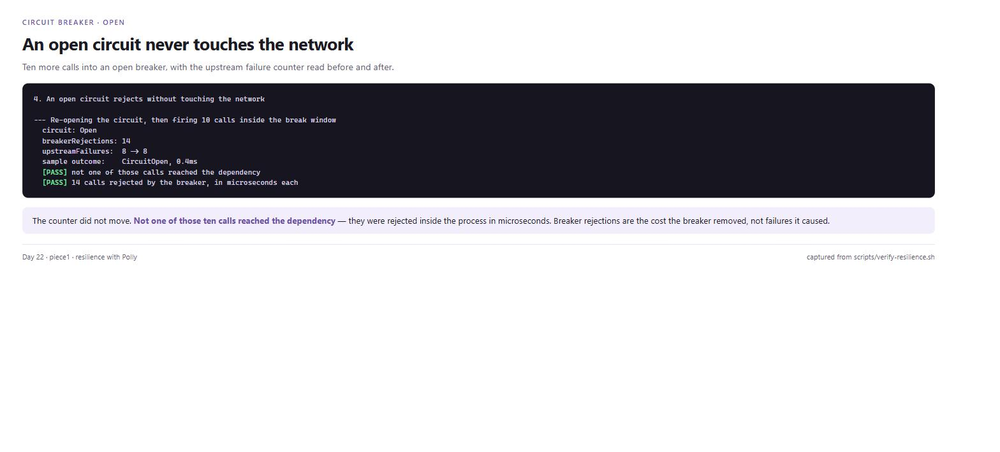
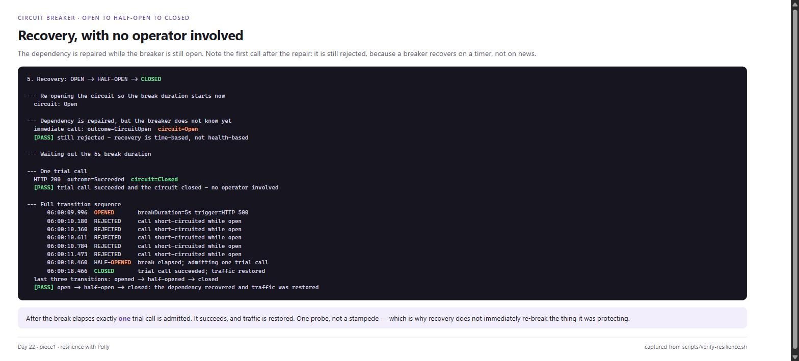
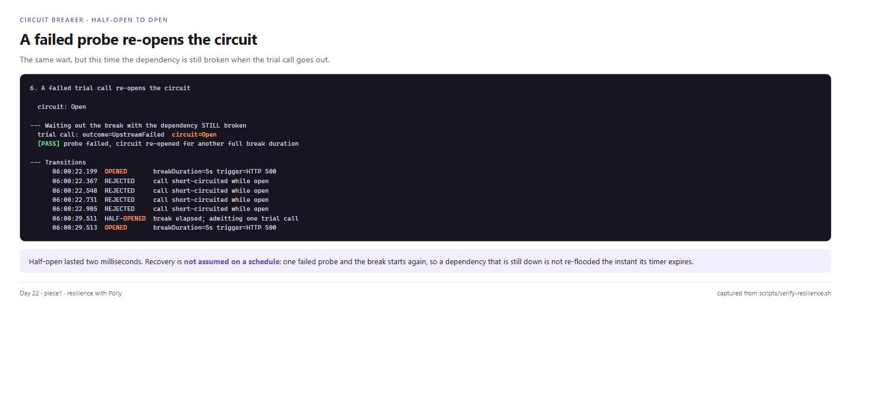
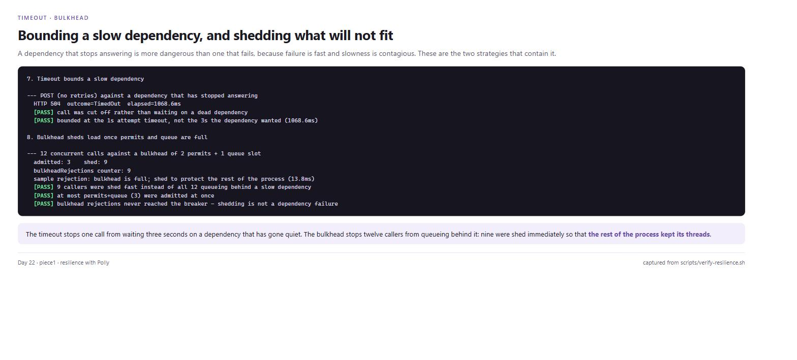
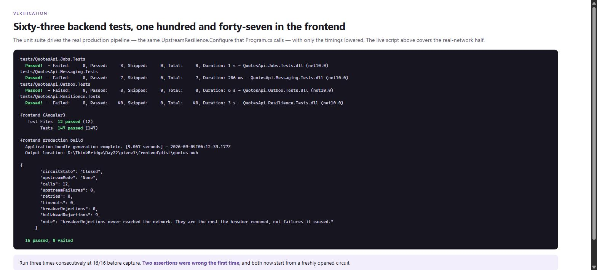

# Day 22 — Resilience with Polly

An outbound dependency wrapped in a Polly v8 pipeline: **bulkhead, total timeout,
idempotent-only retry, circuit breaker, attempt timeout** — and a live proof that the breaker
opens under sustained failure and recovers on its own.

**Deliverable:** [EXERCISE.md](EXERCISE.md) — the pipeline, plus the breaker's
closed → open → half-open → closed logs.
**Change-by-change walkthrough:** [update_code.md](update_code.md) — every file and method I
touched, and why.

Built on Day 21. **Days 17–21 are unchanged.**

## Headline

| | Result |
|---|---:|
| Live proof (`verify-resilience.sh`) | **16 passed, 0 failed** — three consecutive runs |
| Unit proof (`QuotesApi.Resilience.Tests`) | **40 passed** |
| Whole backend suite | **63 passed** across four projects |
| Frontend | **147 passed**, production build clean |

Cost of a call once the breaker is open: **0.4 ms, zero sockets, zero threads.**
Same call with the breaker closed and the dependency down: a round trip, a 500, and up to four
attempts.

```
call 7  -> HTTP 500  outcome=UpstreamFailed   elapsed=1.3ms   circuit=Closed
call 8  -> HTTP 500  outcome=UpstreamFailed   elapsed=12.1ms  circuit=Open
call 9  -> HTTP 503  outcome=CircuitOpen      elapsed=2.9ms   circuit=Open
call 10 -> HTTP 503  outcome=CircuitOpen      elapsed=0.5ms   circuit=Open
```

Full output: [`docs/resilience-verification.txt`](docs/resilience-verification.txt).

## The pipeline

Polly v8 nests strategies like middleware — **first added is outermost**, so the order is the
design, not a formatting choice.

```
caller
  -> [1] concurrency limiter   (bulkhead)      outermost
       -> [2] total timeout    (whole operation, retries included)
            -> [3] retry       (idempotent requests only)
                 -> [4] circuit breaker
                      -> [5] attempt timeout   innermost
                           -> HttpClient -> upstream
```

- **Bulkhead outermost** — it caps how much of this process the dependency may consume, which
  only works if it is the first thing a call meets.
- **Retry outside the breaker** — every attempt is then counted as a breaker sample. Inside, a
  burst of retries at a dead dependency would register as one sample and the breaker would never
  trip.
- **Attempt timeout inside the breaker** — a timeout is a failure the breaker must count.
- **Two timeouts** — one bounds an attempt, one bounds the caller's total wait. With only the
  first, four attempts plus backoff makes a "resilient" client slower than no pipeline at all.

## What changed

```
backend/
  Resilience/
    UpstreamResilience.cs      <- the pipeline: all five strategies, and why they sit in that order
    UpstreamClient.cs          <- the single choke point for outbound calls; sets the idempotency flag
    UpstreamOptions.cs         <- every knob, bindable from configuration
    UpstreamFaults.cs          <- mutable singleton: break the dependency at runtime, without a restart
    ResilienceEventLog.cs      <- timestamped transitions + counters; how the breaker becomes observable
  Extensions/
    ResilienceExtensions.cs    <- AddResiliencePipeline, the typed client, base-address resolution
  Endpoints/
    ResilienceEndpoints.cs     <- the fake upstream, the two callers, state/events/stats, fault control
  Program.cs                   <- + AddUpstreamResilience, + MapResilienceEndpoints,
                                  - the Week-1 AddHttpClient("ExternalService") stub
tests/QuotesApi.Resilience.Tests/
  PipelineHarness.cs           <- builds the REAL pipeline, only the timings lowered
  ResiliencePipelineTests.cs   <- 40 tests, one per promise the pipeline makes
scripts/
  verify-resilience.sh         <- the live proof, 8 sections against a running process
  build-screenshot-cards.mjs   <- renders Screenshots/ from the captured output
```

## Endpoints

| Method | Route | Purpose |
|---|---|---|
| `GET` | `/api/resilience/call` | drive the pipeline with a **GET** — idempotent, so retries apply |
| `POST` | `/api/resilience/call-write` | drive it with a **POST** — retries do not apply |
| `GET` | `/api/resilience/state` | live circuit state, plus the configuration in force |
| `GET` | `/api/resilience/events` | ordered event log (`?transitionsOnly=true` for the breaker) |
| `GET` | `/api/resilience/stats` | calls, failures, retries, timeouts, breaker/bulkhead rejections |
| `POST` | `/api/resilience/reset` | zero the log |
| `POST` | `/api/resilience/breaker/isolate` | hold the circuit open — the incident kill switch |
| `POST` | `/api/resilience/breaker/close` | close it and clear the window |
| `POST` | `/api/resilience/upstream/faults` | break the dependency on demand. **Development only** |
| `GET` | `/upstream/quote-of-the-day` | the dependency itself, idempotent |
| `POST` | `/upstream/notify` | the dependency itself, not idempotent |

The upstream endpoints sit outside `/api` deliberately: Day 17's `CallerIdentity` middleware
demands an Entra app-only token on `/api/*`, and the process calling itself would be turned away
by its own security.

## Configuration

Bind under `Upstream:` (or `Upstream__*` as environment variables).

| Setting | Default | Meaning |
|---|---|---|
| `BaseAddress` | *(auto)* | empty ⇒ resolved from the addresses Kestrel actually bound |
| `AttemptTimeout` | `00:00:01` | bounds one network call |
| `TotalTimeout` | `00:00:10` | bounds the whole operation, retries included |
| `MaxRetryAttempts` | `3` | four attempts in total |
| `RetryBaseDelay` | `00:00:00.200` | exponential, jittered |
| `FailureRatio` | `0.5` | failure fraction that trips the breaker |
| `SamplingDuration` | `00:00:10` | the rolling window the ratio is measured over |
| `MinimumThroughput` | `4` | calls required before the ratio means anything |
| `BreakDuration` | `00:00:05` | how long the breaker stays open |
| `MaxConcurrency` | `4` | bulkhead permits |
| `MaxQueue` | `2` | bulkhead waiting room |

`TotalTimeout` must comfortably exceed `AttemptTimeout × (MaxRetryAttempts + 1)` plus the
backoff, or it fires mid-retry and the retries were pointless.

## Running it

```bash
cd Day22/piece1

# Unit proof — 40 tests over the real production pipeline
dotnet test tests/QuotesApi.Resilience.Tests --nologo

# Live proof — starts a real process, breaks the dependency, watches the breaker recover
bash scripts/verify-resilience.sh

# Whole backend suite
for t in Jobs Messaging Outbox Resilience; do
  (cd tests/QuotesApi.$t.Tests && dotnet test --nologo)
done

# Backend + frontend together
cd backend  && Jwt__Key="$(openssl rand -base64 48)" dotnet run   # :5267
cd frontend && npm start                                          # :4200, proxies /api -> :5267
```

Driving it by hand once the backend is up:

```bash
BASE=http://localhost:5267

curl -s "$BASE/api/resilience/state"

# break the dependency, then watch the circuit trip
curl -s -X POST "$BASE/api/resilience/upstream/faults" \
     -H 'Content-Type: application/json' -d '{"mode":"ServerError"}'

for i in $(seq 1 12); do curl -s -X POST "$BASE/api/resilience/call-write" >/dev/null; done
curl -s "$BASE/api/resilience/events?transitionsOnly=true"

# repair it and wait out the break to see half-open -> closed
curl -s -X POST "$BASE/api/resilience/upstream/faults" \
     -H 'Content-Type: application/json' -d '{"mode":"None"}'
sleep 6 && curl -s -X POST "$BASE/api/resilience/call-write"
```

## Screenshots

Every line of terminal output on these cards is sliced out of
[`docs/resilience-verification.txt`](docs/resilience-verification.txt) and
[`docs/test-results.txt`](docs/test-results.txt) **at build time** by
[`scripts/build-screenshot-cards.mjs`](scripts/build-screenshot-cards.mjs). Nothing is retyped,
so a card cannot drift away from the run it claims to show. Regenerate with:

```bash
node scripts/build-screenshot-cards.mjs
npx http-server .shots -p 8099
```

### 1. The pipeline in force



Read back from the running process rather than from source — these are the numbers the breaker,
the retry, both timeouts and the bulkhead are actually enforcing.

### 2. Retry is idempotent-only



One dependency, one fault, one pipeline. The `GET` is retried three times; the `POST` is not
retried at all. A retry cannot tell *"the request never arrived"* from *"the request was
processed and the response was lost"* — retrying the read is free, retrying the write charges the
customer twice.

### 3. The circuit opens under sustained failure



Twelve calls at a dependency answering 500. On call 8 the failure ratio crosses its threshold and
every call after it stops reaching the network.

### 4. An open circuit never touches the network



Ten more calls, and the upstream failure counter does not move. Breaker rejections are the cost
the breaker **removed**, not failures it caused.

### 5. Recovery: open → half-open → closed



The dependency is repaired while the breaker is open, and the next call is still rejected —
recovery is time-based, not health-based. After the break, exactly **one** trial call is
admitted; it succeeds, and traffic is restored with no operator involved.

### 6. A failed probe re-opens the circuit



Same wait, dependency still broken. Half-open lasted two milliseconds and the break started
again — a service that is still down is not re-flooded the instant its timer expires.

### 7. Timeout and bulkhead



A dependency that stops answering is more dangerous than one that fails, because failure is fast
and slowness is contagious. The timeout bounds the one call; the bulkhead stops the other eleven
queueing behind it.

### 8. Tests



The unit suite drives the same `UpstreamResilience.Configure` that `Program.cs` calls, with only
the timings lowered — a test that composed its own strategies would pass happily while the
shipped pipeline was ordered wrong.

## Notes on what is *not* here

The dependency being protected is a fake, hosted in this same process under `/upstream/*`. The
call to it is a genuine HTTP request over a real socket — real status codes, real connection
handling, a real timeout when it goes quiet — but it is not a third party. That is deliberate:
the proof needs to switch the dependency between healthy and broken **inside one process run**,
because a circuit breaker's state only means something across a continuous timeline. Pointing at
a real service instead is a one-line configuration change (`Upstream:BaseAddress`).
