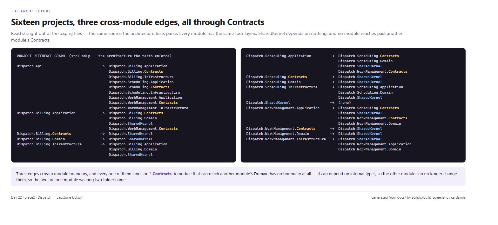
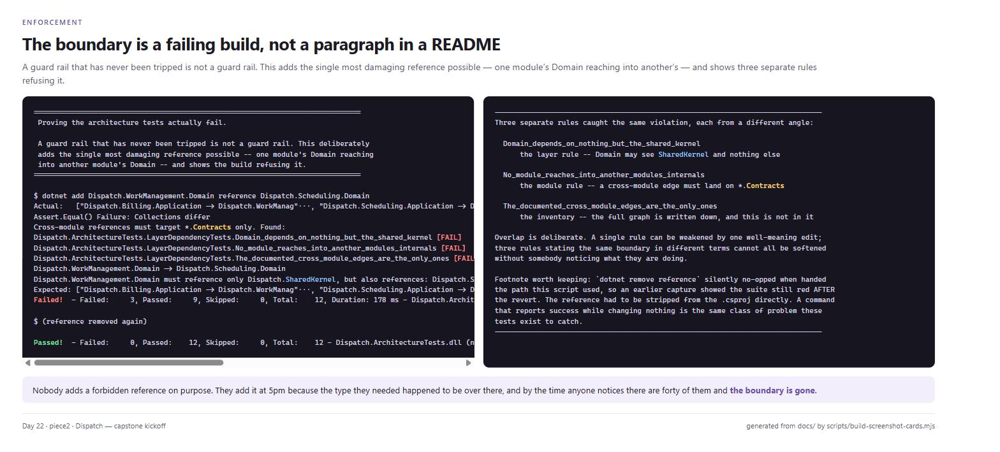
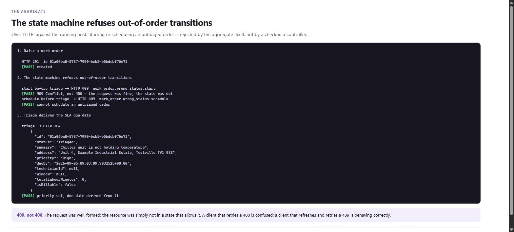
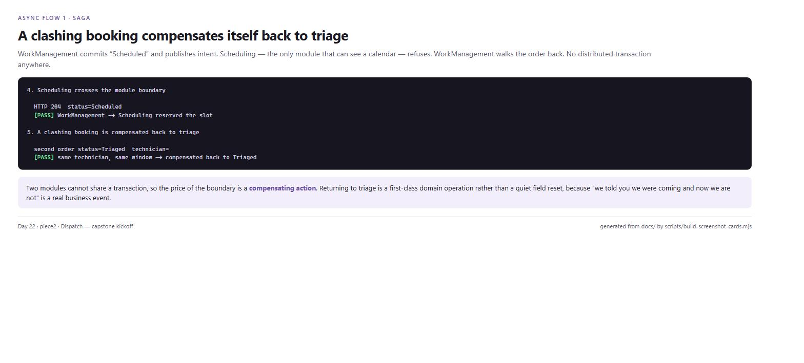
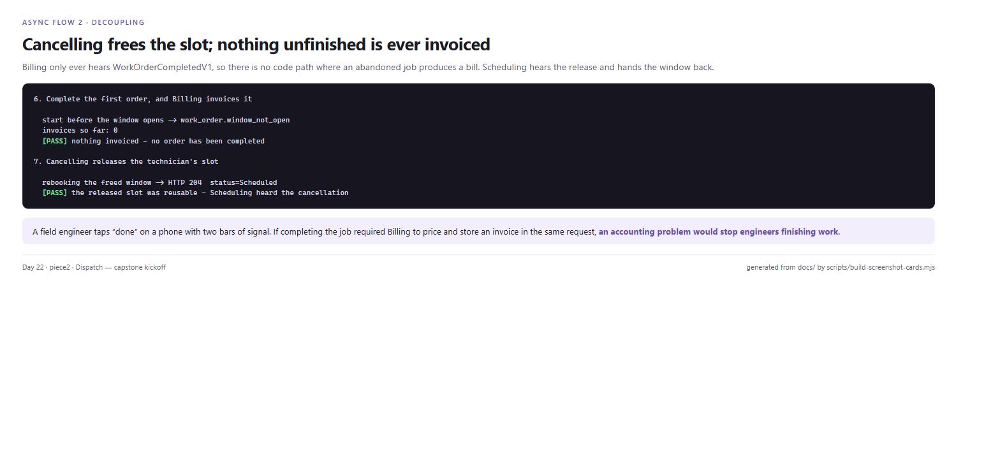
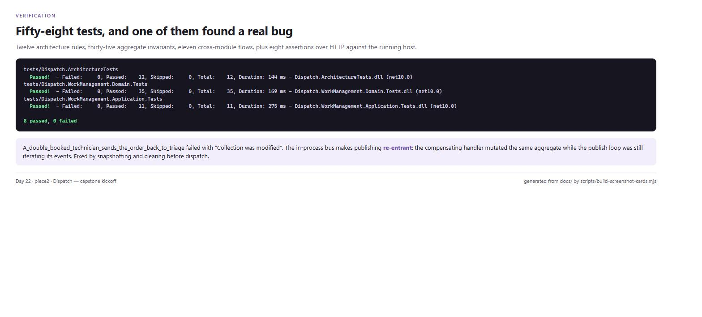

# Day 22 piece 2 — Capstone kickoff: Dispatch

A field-service platform, designed as a **modular monolith** with clean architecture inside each
module, scaffolded end to end and enforced by tests.

**Deliverable:** [EXERCISE.md](EXERCISE.md) — repo, one-page design, solution layout.
**The design:** [DESIGN.md](DESIGN.md) — contexts, aggregate, async flows, and the reasoning.
**Change-by-change walkthrough:** [update_code.md](update_code.md) — every file, and why.

Standalone. This does not build on the Week-1 quotes API; a capstone starts fresh.

## Headline

| | Result |
|---|---:|
| Projects | **16** — 3 modules × 4 layers, plus shared kernel and host |
| Cross-module edges | **3**, all through `*.Contracts` |
| Architecture rules enforced | **12** — the build fails on a violation |
| Domain invariants tested | **35** |
| Cross-module flow tests | **11** |
| HTTP smoke assertions | **8 passed, 0 failed** |

One of those tests found a real re-entrancy bug in the event dispatch. Details in
[EXERCISE.md](EXERCISE.md#a-real-bug-the-tests-found).

## The system

```
                        ┌──────────────────────────────┐
                        │        Dispatch.Api          │  single deployable
                        │   composition root + HTTP    │  in-process event bus
                        └───────────────┬──────────────┘
                                        │
          ┌─────────────────────────────┼─────────────────────────────┐
          │                             │                             │
  ┌───────▼────────┐           ┌────────▼────────┐          ┌─────────▼────────┐
  │ WorkManagement │           │   Scheduling    │          │     Billing      │
  │     (core)     │           │  (supporting)   │          │   (supporting)   │
  │                │           │                 │          │                  │
  │   WorkOrder    │──events──▶│   Reservation   │          │     Invoice      │
  │                │◀──────────│                 │          │                  │
  │                │───────────────── events ───────────────▶                  │
  └────────────────┘           └─────────────────┘          └──────────────────┘
       Contracts                    Contracts                    Contracts
    (the only door)              (the only door)              (the only door)
```

Each module has the same four layers:

```
Contracts        the published contract -- primitives only, versioned in the name
Domain           aggregates and invariants -- references SharedKernel and nothing else
Application      use cases and ports -- declares what it needs, never how
Infrastructure   adapters and registration -- implements the ports
```

## Layout

```
src/
  Dispatch.Api/                                 composition root, HTTP, in-process bus
  Dispatch.SharedKernel/                        Entity, AggregateRoot, Result, events, IClock
  Modules/
    WorkManagement/  Contracts Domain Application Infrastructure
    Scheduling/      Contracts Domain Application Infrastructure
    Billing/         Contracts Domain Application Infrastructure
tests/
  Dispatch.ArchitectureTests/                   the rules, enforced
  Dispatch.WorkManagement.Domain.Tests/         the aggregate's invariants
  Dispatch.WorkManagement.Application.Tests/    the async flows, across real boundaries
scripts/
  smoke.sh                                      drives the running host over HTTP
  build-screenshot-cards.mjs                    renders Screenshots/ from docs/
docs/
  reference-graph.txt                           generated from the .csproj files
  architecture-guardrail-proof.txt              a deliberate violation, caught
  test-results.txt  smoke-output.txt            captured output
```

## Endpoints

| Method | Route | Purpose |
|---|---|---|
| `POST` | `/api/work-orders` | report a fault |
| `GET` | `/api/work-orders/{id}` | current state |
| `POST` | `/api/work-orders/{id}/triage` | set priority; derives the SLA due date |
| `POST` | `/api/work-orders/{id}/schedule` | commit to a technician and a window |
| `POST` | `/api/work-orders/{id}/start` | begin work on site |
| `POST` | `/api/work-orders/{id}/labour` | log time |
| `POST` | `/api/work-orders/{id}/complete` | finish; makes the order billable |
| `POST` | `/api/work-orders/{id}/cancel` | abandon, with a reason |
| `GET` | `/api/invoices` | read-only |
| `GET` | `/health` | |

There is deliberately **no** `POST /api/invoices`. Invoices are not something a user asks for;
they are a consequence of work being completed, and the only way one comes into existence is the
`WorkOrderCompletedV1` subscription.

A rejected transition returns **409**, not 400 — the request was well-formed, the resource was
simply not in a state that allows it.

## Running it

```bash
cd Day22/piece2

dotnet build                                        # 16 projects

# The rules
dotnet test tests/Dispatch.ArchitectureTests --nologo                  # 12

# The aggregate
dotnet test tests/Dispatch.WorkManagement.Domain.Tests --nologo        # 35

# The flows, across real module boundaries
dotnet test tests/Dispatch.WorkManagement.Application.Tests --nologo   # 11

# The whole thing over HTTP against a running host
bash scripts/smoke.sh                                                  # 8 assertions

# Or just run it
cd src/Dispatch.Api && dotnet run                                      # :5322 by default
```

Driving it by hand:

```bash
BASE=http://localhost:5322

ID=$(curl -s -X POST "$BASE/api/work-orders" -H 'Content-Type: application/json' \
  -d '{"customerId":"11111111-1111-1111-1111-111111111111",
       "summary":"Chiller unit is not holding temperature",
       "line":"Unit 4, Example Industrial Estate","city":"Testville","postcode":"TV1 9ZZ"}' \
  | node -e 'let s="";process.stdin.on("data",d=>s+=d).on("end",()=>console.log(JSON.parse(s).id))')

curl -s -X POST "$BASE/api/work-orders/$ID/start"     # 409 - not triaged yet
curl -s -X POST "$BASE/api/work-orders/$ID/triage" -H 'Content-Type: application/json' \
     -d '{"priority":"High"}'
curl -s "$BASE/api/work-orders/$ID"
```

**Frontend:** there isn't one, and that is deliberate — the exercise is a design and a solution
scaffold. Adding a UI now would mean designing a read model before the write model has met a
single real requirement.

## Screenshots

Every line of output on these cards is read out of `docs/*.txt` **at build time** by
[`scripts/build-screenshot-cards.mjs`](scripts/build-screenshot-cards.mjs). Nothing is retyped, so
a card cannot drift from the run it claims to show.

```bash
node scripts/build-screenshot-cards.mjs
npx http-server .shots -p 8110
```

### 1. The architecture, read from the project files



Sixteen projects. Every module has the same four layers, `SharedKernel` depends on nothing, and
the three cross-module edges all land on `*.Contracts`.

### 2. The boundary is a failing build



A deliberate `WorkManagement.Domain → Scheduling.Domain` reference, caught by three separate
rules. Overlap is intentional: one rule can be weakened by a well-meaning edit, three stating the
same boundary in different terms cannot all be softened without somebody noticing.

### 3. The aggregate refuses out-of-order transitions



Over HTTP against the running host. The refusal comes from the aggregate, not from a check in a
controller — and triage derives the SLA due date from the priority, once.

### 4. The scheduling saga compensates itself



Two orders, one technician, one window. WorkManagement commits "Scheduled" and publishes intent;
Scheduling refuses; the order walks itself back to Triaged. No distributed transaction anywhere.

### 5. Release and rebook



Cancelling frees the slot, and the second order takes it. Nothing unfinished is ever invoiced,
because `WorkOrderCompletedV1` is the only thing that drafts an invoice.

### 6. Tests



Fifty-eight tests plus eight HTTP assertions — and the note on the re-entrancy bug one of them
caught.

## What this is not, yet

Stated so they read as decisions rather than oversights.

- **No persistence.** All three stores are dictionaries. The ports exist so that choosing a
  database later is an Infrastructure change and nothing else.
- **Publish-after-commit is two operations.** A crash between them loses the event. Day 20's
  transactional outbox is the fix.
- **A failed handler drops its event.** No retry, no dead-letter — a broker gives both.
- **The overlap check races.** Two concurrent bookings can both pass it; the fix is a database
  constraint, not more C#.
- **No authentication, no read models, no UI.**
