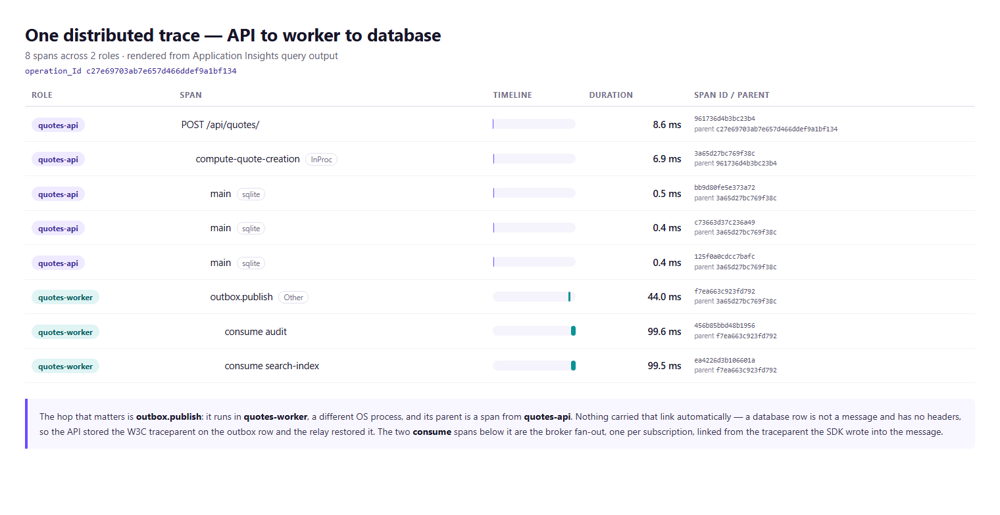

# Day 26 — App Insights + KQL

OpenTelemetry wired to Application Insights, KQL for p50/p99, the dependency breakdown and an
error-rate alert, and a distributed trace proven to stitch **API → worker → DB**.

## Result

| | |
|---|---:|
| Spans in one end-to-end trace | **8**, across **2** roles |
| Traces crossing both roles | **11 of 11** quote creations |
| `outbox.reparented = true` | **22 of 22** publishes |
| KQL assertions | **6 passed, 0 failed** |
| Bugs found on the way | **7** |

Captured: [`docs/portal-end-to-end-transaction.jpg`](docs/portal-end-to-end-transaction.jpg) ·
[`docs/kql-results.txt`](docs/kql-results.txt) ·
[`docs/distributed-trace.png`](docs/distributed-trace.png) ·
[`docs/trace-spans.json`](docs/trace-spans.json)

The portal screenshot is cropped below the Azure global nav bar, which carries the signed-in
account's address. Cropped rather than blurred: a blur over text invites the question of what was
hidden, while a crop simply does not contain it.

---

## 1. The distributed trace

Azure portal, **End-to-end transaction details**, one `operation_Id`, eight spans, two roles:


```
EVENT                                          RES.  DURATION
127.0.0.1:5310  POST /api/quotes/              201     8.6 ms   <- quotes-api
  compute-quote-creation                                6.9 ms
    SQLITE ThinkBridge | main   main                  451.8 us
    SQLITE ThinkBridge | main   main                  380.4 us
    SQLITE ThinkBridge | main   main                  447.3 us
  OTHER outbox.publish                                 44.0 ms
    quotes-worker  consume audit                 0     99.6 ms   <- quotes-worker
    quotes-worker  consume search-index          0     99.5 ms   <- quotes-worker
```

The portal nests `outbox.publish` and both `consume` spans **inside** the API request, and labels
the two consumers with their own role name. That nesting is the whole deliverable: the worker is a
different OS process, and the only thing connecting it to the request is the traceparent the API
stored on the outbox row.

The right-hand pane in that screenshot shows the selected `consume search-index` span carrying the
custom properties the code attaches — `messaging.subscription: search-index`,
`messaging.message_id`, `messaging.delivery_attempt: 1`.

The same trace, drawn from the raw query output for a closer look at the parent ids:



```
role           span                                    duration   parent
-------------  --------------------------------------  ---------  ------------------
quotes-api     POST /api/quotes/                           8.6ms   961736d4b3bc23b4  (root)
quotes-api       compute-quote-creation      [InProc]      6.9ms   3a65d27bc769f38c
quotes-api         main                      [sqlite]     0.5ms   bb9d80fe5e373a72
quotes-api         main                      [sqlite]     0.4ms   c73663d37c236a49
quotes-api         main                      [sqlite]     0.4ms   125f0a0cdcc7bafc
quotes-worker    outbox.publish              [Other]     44.0ms   f7ea663c923fd792  <- parent is an API span
quotes-worker      consume audit                         99.6ms   456b85bbd48b1956
quotes-worker      consume search-index                  99.5ms   ea4226d3b106601a
```

**The line that proves it** is `outbox.publish`. It executes in `quotes-worker` — a different OS
process — and its parent is `3a65d27bc769f38c`, a span in `quotes-api`. Below it the two
`consume` spans are the broker fan-out, one per subscription, both children of the publish.

Nothing carried those links automatically. Two hops had to be made to work:

| hop | carries context? | what was needed |
|---|---|---|
| API → outbox row | **no** — a row has no headers | store the W3C traceparent in a column |
| outbox row → publish | **no** — different process, no ambient Activity | re-parent from that column |
| publish → Service Bus | in principle yes | the SDK writes it into message properties |
| Service Bus → consumer | **not observed** | read it back from the message explicitly |

### The trace-stitch query, written so it can fail

```kql
union
    (requests     | extend telemetry = 'request'),
    (dependencies | extend telemetry = 'dependency')
| where timestamp > ago(1h)
| summarize
    spans     = count(),
    roles     = make_set(cloud_RoleName),
    roleCount = dcount(cloud_RoleName),
    tiers     = make_set(type),
    started   = min(timestamp),
    ended     = max(timestamp)
  by operation_Id
| where roleCount > 1                      // <-- the assertion. Zero rows means it is broken.
| extend spanMs = round(datetime_diff('millisecond', ended, started), 0)
| project operation_Id, roleCount, roles, spans, tiers, spanMs, started
| order by started desc
```

If the outbox column were not carrying the traceparent, no `operation_Id` would contain both
roles and this returns nothing. It returns 11 rows, one per quote created:

```
operation_Id                      roleCount  roles                           spans  spanMs
--------------------------------  ---------  ------------------------------  -----  ------
3e7be5eff4f6faf8cbc8e61e756b3576  2          ["quotes-api","quotes-worker"]  6      1102
dbda8065384df36fc903d6191d777c6f  2          ["quotes-api","quotes-worker"]  6      1516
...                                                                                 11 rows
```

`scripts/query-kql.sh` turns that row count into a pass/fail and **exits non-zero if it is zero**.

---

## 2. p50 / p99 by endpoint

```kql
requests
| where timestamp > ago(1h)
| where cloud_RoleName == 'quotes-api'     // the worker maps no endpoints
| where name !has 'health'                 // probes would drag every aggregate down
| summarize
    calls    = count(),
    failures = countif(success == false),
    p50      = round(percentile(duration, 50), 1),
    p95      = round(percentile(duration, 95), 1),
    p99      = round(percentile(duration, 99), 1),
    max      = round(max(duration), 1)
  by endpoint = name
| extend tailRatio    = round(todouble(p99) / iff(p50 == 0, 1.0, todouble(p50)), 1)
| extend errorRatePct = round(100.0 * failures / calls, 1)
| project endpoint, calls, p50, p95, p99, max, tailRatio, failures, errorRatePct
| order by p99 desc
```

```
endpoint                  calls  p50    p95    p99   max   tailRatio  failures  errorRatePct
------------------------  -----  -----  -----  ----  ----  ---------  --------  ------------
POST /api/auth/login      2      758.5  817    817   817   1.1        0         0
POST /api/quotes/         22     46.8   475.5  483   483   10.3       0         0
GET /api/quotes/          10     261    372    372   372   1.4        0         0
GET /api/quotes/{id:int}  6      3      17.7   17.7  17.7  5.9        6         100
GET /api/outbox/          2      6.4    9.7    9.7   9.7   1.5        0         0
```

Percentiles rather than an average, because an average hides the thing you need. 99 requests at
20 ms and one at 5 s averages to 70 ms — a number no user experienced.

`tailRatio` is the column worth reading. **`POST /api/quotes/` has a p50 of 47 ms and a p99 of
483 ms — a ratio of 10.3.** That is not slowness, it is *inconsistency*: the median write is fast
and roughly one in twenty takes ten times longer. The median alone would never show it, and the
dependency breakdown below says what it is.

---

## 3. Dependency call breakdown

```kql
dependencies
| where timestamp > ago(1h)
| summarize
    calls      = count(),
    failures   = countif(success == false),
    p50        = round(percentile(duration, 50), 1),
    p99        = round(percentile(duration, 99), 1),
    totalMs    = round(sum(duration), 0),
    operations = dcount(operation_Id)
  by role = cloud_RoleName, type, target, name = tostring(split(name, ' ')[0])
| extend callsPerOperation = round(todouble(calls) / iff(operations == 0, 1.0, todouble(operations)), 1)
| project role, type, target, name, calls, operations, callsPerOperation, p50, p99, totalMs, failures
| order by totalMs desc
```

```
role           type      target                       calls  operations  callsPerOp  p50     p99     totalMs
-------------  --------  ---------------------------  -----  ----------  ----------  ------  ------  -------
quotes-worker  InProc    AzureCliCredential.GetToken  2      2           1           2004.1  2091.3  4095
quotes-worker  Other     outbox.publish               22     22          1           60.4    470.2   2151
quotes-api     InProc    compute-quote-creation       22     22          1           44.9    372.8   1414
quotes-worker  sqlite    main                         105    105         1           0.7     64      205
quotes-api     sqlite    main                         96     46          2.1         0.5     47      148
```

Three things this says that the latency query could not:

**The most expensive single dependency is a token fetch.** `AzureCliCredential.GetToken` takes
**2 seconds** and dominates total time — it shells out to the Azure CLI. It happens twice, once
per process at startup, so it costs nothing per request; but it is the reason the worker's first
publish is slow, and in Azure it would be a managed-identity call measured in milliseconds.

**`totalMs`, not `p50`, identifies what to optimise.** SQLite is the fastest thing here at 0.5 ms
median and still accumulates 353 ms across both roles, because it is called 201 times.

**`callsPerOperation` is the N+1 detector.** Every row is 1.0 except the API's SQLite at 2.1 —
which is the quote insert plus the outbox insert, in one transaction. Exactly what the code says
it does. A value of 40 here would mean a loop that should have been a join.

---

## 4. Error rate, and the alert

```kql
requests
| where timestamp > ago(1h)
| where cloud_RoleName == 'quotes-api'
| summarize total = count(), failed = countif(success == false) by bin(timestamp, 5m)
| extend errorRatePct = round(100.0 * failed / total, 2)
| project timestamp, total, failed, errorRatePct
| order by timestamp asc
```

```
timestamp             total  failed  errorRatePct
--------------------  -----  ------  ------------
2026-09-10T07:35:00Z  22     3       13.64
```

The alert, deployed as Bicep in `infra/modules/alert.bicep`, fires on **> 5% over 15 minutes**,
evaluated every 5 minutes:

```kql
requests
| summarize Total = count(), Failed = countif(success == false)
| where Total > 10
| project ErrorRatePercent = round(100.0 * Failed / Total, 2)
```

**A rate, not a count.** Ten failures a minute is a catastrophe at 20 rpm and noise at 50,000. A
count threshold has to be retuned every time traffic changes and in practice never is, so it
either screams through a healthy spike or stays silent through an overnight outage.

**`| where Total > 10` is the most important line.** Without it, one failed request in an idle
minute is a 100% error rate and the alert fires — at 3am, on a dev environment, on a health
probe. That single line is the difference between an alert people act on and one they mute, and a
muted alert is worse than none because it still looks like coverage on a dashboard.

**`success == false`, not `resultCode >= 500`.** A 4xx storm is also an outage from the caller's
point of view; an expired key returning 401 to every client is not "fine, those are client
errors".

No time filter and no `bin()` in the alert version: a scheduled query rule supplies its own window
via `windowSize`, and adding `ago()` would AND two windows together and evaluate the wrong span.

Verified live:

```
alert rule (enabled severity window): true 2 0:15:00
PASS  the error-rate alert rule is deployed and enabled
```

---

## 5. How the trace was made to stitch

### The API stores the context on the row

```csharp
// OutboxWriter.Enqueue — the only moment the context exists.
TraceParent = Activity.Current?.Id,
TraceState  = Activity.Current?.TraceStateString
```

`?.` and not `!`: a message enqueued by a background job has no ambient activity, and telemetry
must never be the reason a business write throws.

### The relay restores it

```csharp
// OutboxRelay — parentId takes a W3C traceparent STRING, which is all that survived.
using var publishActivity = string.IsNullOrEmpty(message.TraceParent)
    ? Telemetry.Outbox.StartActivity("outbox.publish", ActivityKind.Producer)
    : Telemetry.Outbox.StartActivity("outbox.publish", ActivityKind.Producer,
                                      parentId: message.TraceParent);

publishActivity?.SetTag("outbox.reparented", !string.IsNullOrEmpty(message.TraceParent));
```

The parent `Activity` is long gone — it ended when the HTTP response was written, in another
process, seconds earlier. Only its *identity* survived, on the row, and an identity is all the
linkage needs.

That `outbox.reparented` tag is what makes the proof falsifiable rather than circumstantial:

```
outbox.publish spans by reparented flag:
    True    22
PASS  outbox publishes were re-parented from the stored traceparent
```

If the traces linked for some other reason, this would read `False`.

### The consumer reads it back from the message

```csharp
private static string? ReadTraceParent(ServiceBusReceivedMessage message)
{
    foreach (var key in new[] { "Diagnostic-Id", "traceparent" })
        if (message.ApplicationProperties.TryGetValue(key, out var v)
            && v?.ToString() is { Length: > 0 } candidate)
            return candidate;
    return null;
}
```

This should not have been necessary — the Azure SDK writes the context on send and starts a
Consumer span from it on receive. Measured, it did not happen: the consume spans arrived as
**separate root traces**, five under `consume audit` and five under `consume search-index`, with
no Service Bus dependency spans anywhere. Reading the property directly fixed it.

### Two roles from one binary

```csharp
var serviceRole = (builder.Configuration["SERVICE_ROLE"] ?? "all").Trim().ToLowerInvariant();
var roleName = serviceRole switch
{
    "api"    => Telemetry.ApiRoleName,      // "quotes-api"
    "worker" => Telemetry.WorkerRoleName,   // "quotes-worker"
    _        => "quotes-all-in-one"
};

.ConfigureResource(r => r.AddService(
    serviceName: roleName,
    serviceInstanceId: $"{Environment.MachineName}:{Environment.ProcessId}"))
```

Before today the API and its workers were one process, and a trace of that demonstrates nothing —
`Activity` flows on the async context, so every span is already parented with nothing wired.
`service.name` becomes `cloud_RoleName`, which is what App Insights groups on to decide how many
boxes to draw. One role would still stitch correctly and render as a single box: right, and
useless as evidence.

---

## 6. Seven things that broke

Every one produced a green-looking result while being wrong.

1. **Stale Redis config.** An inherited `backend/.env` pointed at `localhost:6379`. Every cache
   write blocked for the full 5-second connect timeout before failing, so latency percentiles
   were measuring a broken dependency rather than the application.

2. **`EnsureCreated` raced.** Splitting one process into two meant both called it against the same
   empty file: `SQLite Error 1: 'table "OutboxMessages" already exists'`. The check and the create
   are separate statements. Fixed by ownership — the api role creates the schema, the worker polls
   for it — which is also how migrations work anywhere real.

3. **`taskkill` silently failed inside the script** while working at a prompt, leaving processes
   alive across runs holding the database. Replaced with PowerShell `Stop-Process` plus a wait for
   actual exit, because `taskkill` returns when the terminate is *signalled*, not when handles are
   released.

4. **A delete that lied.** The script printed "Removed any existing database" unconditionally. On
   a run where the file was locked it printed that while the old database survived — so seeding
   was skipped, the freshly generated password did not match the stored hash, and login failed
   with a **401 that had nothing to do with auth**. It now verifies and refuses to continue.

5. **`DefaultAzureCredential` aborts off Azure.** Its managed-identity link probes IMDS at
   `169.254.169.254`, and after five retries throws `AuthenticationFailedException` — not
   `CredentialUnavailableException` — so the chain stops instead of falling through to the CLI
   credential that would have worked. The symptom was not an auth error: it was an outbox that
   claimed rows and never published them, with the cause buried under a thousand lines of MSAL
   cache logging.

6. **`source .env` truncated the connection string.** An App Insights connection string contains
   semicolons; unquoted, bash reads the first `;` as a command separator. The app got
   `InstrumentationKey=<guid>` with **no ingestion endpoint**, logged `azureMonitor=enabled`
   because a connection string was present, and exported nothing. Twelve complete traces were
   produced and lost this way before the truncation was spotted.

7. **A hard kill discarded the batch.** Even with the connection string fixed, `requests | count`
   returned 0. OpenTelemetry batches spans and exports on a timer; `Stop-Process -Force` gave it
   no chance to flush. A 60-second flush window before shutdown fixed it.

Two more were in the *verification*, which is worse:

- **The drain check guessed at a response shape**, looked for a `messages` array that does not
  exist, fell back to an empty list, summed zero, and announced "drained" while twelve rows were
  unpublished — killing the worker six seconds after it claimed them. The relay was working; the
  check was not. It now reads the `pending` field and returns `?` rather than `0` when it cannot
  tell.

- **The KQL runner queried the wrong endpoint** (`SEM0100: Failed to resolve table 'requests'`)
  and then rendered nothing at all, because `az monitor app-insights query` returns unusable
  output for `-o table` and a row *count* for `-o tsv`. So `roles seen: 1` was the number one, not
  a role name, and an assertion failed against data that was present all along.

---

## 7. Honest gaps

- **The Application Map is empty.** The end-to-end transaction view renders the trace correctly,
  but the map — which would draw `quotes-api` and `quotes-worker` as two connected nodes — showed
  nothing over the last hour. Most likely a consequence of the missing Azure SDK dependency spans
  below: the map is built from dependency edges between roles, and the edge here is an `InProc`
  span rather than a recognised remote call.
- **No Azure SDK Service Bus spans.** The broker hop is inferred from the publish and consume
  spans either side of it rather than shown directly. `Azure.Messaging.ServiceBus` is registered
  as a source and still produces nothing; the consumer linkage works because the traceparent is
  read from the message manually.
- **Metrics are wired but unused by the queries.** `quotes.outbox.lag`, `quotes.outbox.published`
  and `quotes.messaging.consumed` are recorded, and the KQL reads percentiles from `requests`
  instead — exact at 100% sampling on a dev workload, and the wrong choice at production volume
  where sampling makes trace-derived percentiles unrepresentative.
- **Sampling is pinned at 100%.** Correct for proving a trace is complete, wrong for a busy
  service. A sampled-out span leaves a hole indistinguishable from a propagation bug.
- **The alert has no action group.** It evaluates and fires; nothing is notified. Every useful
  action group contains a personal contact detail, and this repository has spent three days
  avoiding committing one. Adding it is one property.
- **The in-process job queue is not traced.** `Channel<T>` does not carry `Activity.Current` across
  the enqueue/dequeue boundary either, so `POST /api/jobs` → `JobProcessor` has the same break the
  outbox had, and it is not fixed. The mechanism would be identical: capture the traceparent on
  the `Job`, restore it in the processor.
- **SQLite, not Azure SQL.** Two processes sharing one file needed WAL and a busy timeout, which
  is a workaround for a limitation rather than a design. The Azure SQL database Day 25 provisioned
  assumes cross-process concurrency as a baseline.
