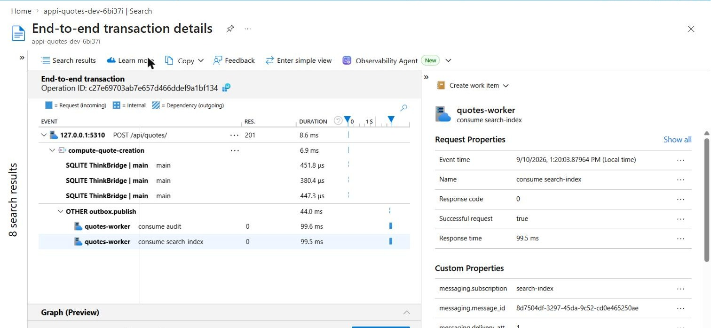

# Day 26 — App Insights + KQL

Day 22 piece 1's QuotesApi, made legible in production. OpenTelemetry wired to Application
Insights, KQL for p50/p99, the dependency breakdown and an error-rate alert, and a distributed
trace proven to stitch **API → worker → DB** across a process boundary.

**Deliverable:** [EXERCISE.md](EXERCISE.md) — the KQL queries and the distributed trace.
**Change-by-change walkthrough:** [update_code.md](update_code.md) — every file, and why.

## Result

| | |
|---|---:|
| Spans in one end-to-end trace | **8**, across **2** roles |
| Traces crossing both roles | **11 of 11** quote creations |
| `outbox.reparented = true` | **22 of 22** publishes |
| KQL assertions | **6 passed, 0 failed** |
| Bugs found on the way | **7**, plus 2 in the verification itself |



*Azure portal, End-to-end transaction details. `outbox.publish` and both `consume` spans are
nested inside the API request and labelled `quotes-worker` — a different process.*

## Why this codebase and not Day 25's

The deliverable is a trace spanning "API **and the worker**", and Day 22 piece 1 is the only
codebase here with all three tiers. Day 25's identity API has no `BackgroundService` at all — its
Service Bus send and receive happen inline in one request handler, so a trace of it is one span
tree in one process and demonstrates nothing.

## The two hops that had to be made to work

In-process tracing is nearly free: `Activity` flows on the async context, so any span raised
inside a request is already the child of that request with nothing wired. A trace only becomes
hard where the async context does not follow.

```
POST /api/quotes            quotes-api      ASP.NET Core instrumentation, automatic
  -> outbox row             ← BREAKS        a row has no headers. Store the traceparent.
    -> outbox.publish       quotes-worker   re-parented from that column
      -> Service Bus        ← BREAKS        read the traceparent back off the message
        -> consume audit    quotes-worker   ...and consume search-index, the fan-out
          -> EF Core        the DB tier, automatic
```

Only two of those hops needed code. The rest was instrumentation that already existed — and would
have been useless without the two that did not.

## Layout

```
Day26/
├── backend/                       Day 22 piece 1's QuotesApi, instrumented
│   ├── Observability/
│   │   └── Telemetry.cs           NEW — every ActivitySource and metric, in one place
│   ├── Models/OutboxMessage.cs    +TraceParent, +TraceState  ← the key change
│   ├── Outbox/OutboxWriter.cs     captures Activity.Current while it still exists
│   ├── Outbox/OutboxRelay.cs      re-parents the publish from the stored traceparent
│   ├── Messaging/SubscriptionWorker.cs  reads the traceparent back off the message
│   └── Program.cs                 SERVICE_ROLE, OTel sources, metrics, WAL
├── infra/
│   ├── main.bicep                 Log Analytics + App Insights + Service Bus + RBAC
│   └── modules/{rbac,alert}.bicep the error-rate alert, as code
├── kql/
│   ├── 01-latency-percentiles.kql p50 / p95 / p99 by endpoint
│   ├── 02-dependency-breakdown.kql where a request's time actually goes
│   ├── 03-error-rate.kql          over time, plus the deployed alert query
│   └── 04-distributed-trace.kql   the stitch proof, written so it can fail
├── scripts/
│   ├── deploy.sh                  provision the telemetry destination
│   ├── run-trace.sh               run both roles, generate traffic, flush
│   ├── query-kql.sh               run every query and ASSERT — exits non-zero if broken
│   ├── capture-trace.sh           pick the richest multi-role trace
│   └── render-trace.mjs           draw it as a waterfall
└── docs/                          captured output from every run
```

## Running it

```bash
cd Day26

./scripts/deploy.sh          # Log Analytics, App Insights, Service Bus, RBAC, alert. ~90s
./scripts/run-trace.sh 12    # both roles, 12 quotes, drain, 60s exporter flush
                             # then wait 2-3 minutes for Log Analytics ingestion
./scripts/query-kql.sh       # four queries + six assertions
./scripts/capture-trace.sh   # docs/trace-spans.json + docs/distributed-trace.png
```

`run-trace.sh` starts **one binary twice**:

| | `SERVICE_ROLE=api` | `SERVICE_ROLE=worker` |
|---|---|---|
| HTTP endpoints | yes | `/health` only |
| owns the schema | **yes** — creates and seeds | polls until it exists |
| outbox relay | disabled | **running** |
| Service Bus consumers | none | **4**, across 2 subscriptions |
| `cloud_RoleName` | `quotes-api` | `quotes-worker` |

One binary rather than two projects, because the alternative duplicates the DI graph and the two
copies drift. The role is a runtime decision; everything else is shared.

## What `query-kql.sh` actually asserts

It is written so that **no data fails rather than passes** — an empty workspace must not be able
to produce a green run.

```
PASS  the api role reported request telemetry
PASS  both 'quotes-api' and 'quotes-worker' reported telemetry
PASS  distributed tracing stitches the API and the worker into ONE trace
PASS  database dependency spans are present (the DB tier)
PASS  outbox publishes were re-parented from the stored traceparent
PASS  the error-rate alert rule is deployed and enabled
 0 failed
```

The third is the deliverable, and it can fail: the query behind it returns zero rows if no
`operation_Id` contains spans from both roles. The fifth is what makes the proof falsifiable
rather than circumstantial — `OutboxRelay` tags every publish with whether it actually found a
stored traceparent, so a trace that linked for some other reason would show `False`.

## Cost

Roughly **USD 0.013/hour**, essentially all Service Bus Standard. App Insights ingestion is free
below 5 GB/month and the workspace is capped at 1 GB/day. Tear down with:

```bash
az group delete -n rg-observability-dev --yes
```

## What is not done

- **The Application Map is empty**, though the end-to-end transaction view is not. The map draws
  its nodes from dependency edges between roles, and the edge here is an `InProc` span rather than
  a recognised remote call — see the missing Azure SDK spans below.
- **No Azure SDK Service Bus spans.** The broker hop is inferred from the spans either side of it.
- **The in-process job queue is not traced.** `Channel<T>` breaks context the same way the outbox
  did; the fix would be identical and is not applied.
- **Metrics are recorded but unqueried** — the KQL reads percentiles from `requests`, which is
  exact at 100% sampling and wrong at production volume.
- **The alert notifies nobody.** No action group, because every useful one contains a personal
  contact detail.
- **SQLite, not Azure SQL.** Two processes sharing one file needed WAL and a busy timeout.
