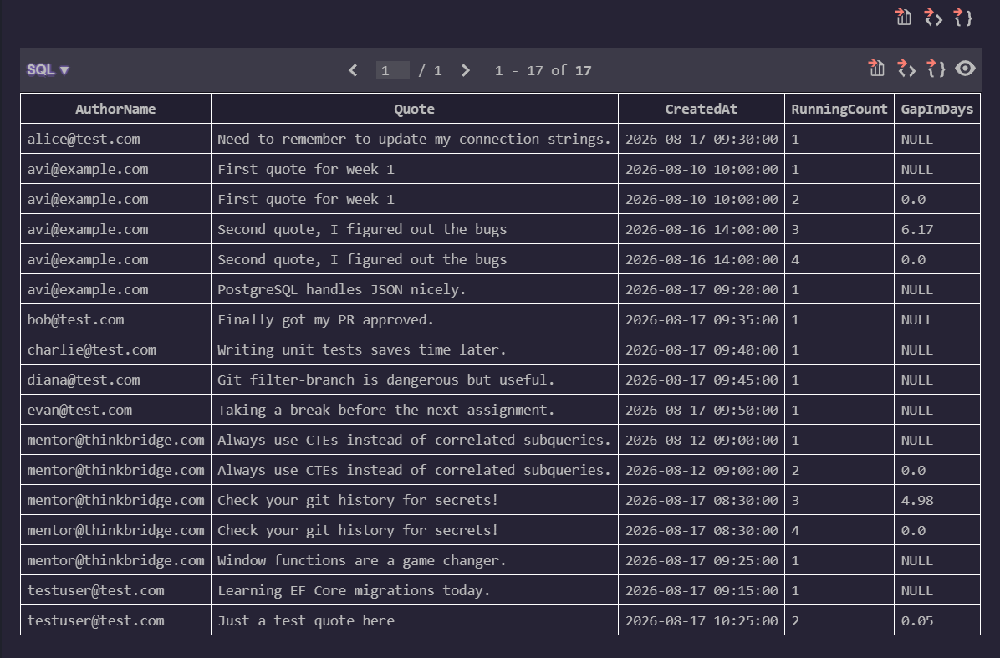

### GitHub link
https://github.com/thinkbridge-thinkschool/thinkschool--PrakharSahu/tree/feature/day7-piece2/Day7/piece2

### Exercise

\\\sql
SELECT 
    u.Email AS AuthorName,
    q.Text AS Quote,
    q.CreatedAt,
    ROW_NUMBER() OVER(PARTITION BY u.Id ORDER BY q.CreatedAt ASC) AS RunningCount,
    ROUND(
        julianday(q.CreatedAt) - julianday(LAG(q.CreatedAt) OVER(PARTITION BY u.Id ORDER BY q.CreatedAt ASC)), 
        2
    ) AS GapInDays
FROM Users u
INNER JOIN Quotes q ON u.Id = q.UserId
ORDER BY u.Email, q.CreatedAt ASC;
\\\

### What did you learn this session?
I learned how window functions preserve individual rows while calculating aggregates. Using \LAG()\ allows for direct sequential row comparisons (like calculating date gaps) without relying on expensive, complex self-joins, while \OVER(PARTITION BY ... ORDER BY ...)\ cleanly manages running counts.

### What would break this?
If the \CreatedAt\ timestamps are saved in a non-standard string format rather than ISO-8601, SQLite's \julianday()\ function will fail to parse them and return NULL. Additionally, if a user submits two quotes at the exact same millisecond, the \ORDER BY\ sequence becomes non-deterministic unless a tie-breaker like \q.Id ASC\ is appended.
