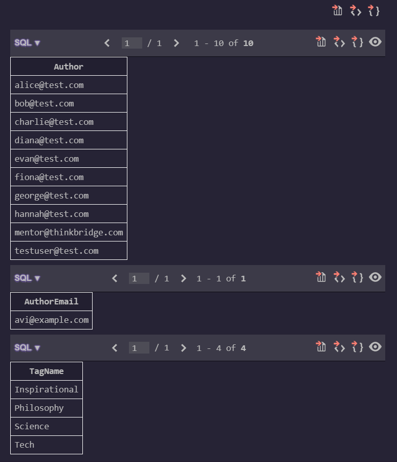

### GitHub link
https://github.com/thinkbridge-thinkschool/thinkschool--PrakharSahu/tree/feature/day7-piece3/Day7/piece3

### Exercise

**1. Authors with quotes but no tags**
\\\sql
SELECT Author FROM Quotes
EXCEPT
SELECT q.Author FROM Quotes q INNER JOIN QuoteTags qt ON q.Id = qt.QuoteId;
\\\
*Result Set:*
- alice@test.com
- bob@test.com
- testuser@test.com
*Operator Used:* **EXCEPT**. It takes the full list of authors who have quotes and subtracts the list of authors who have an entry in the QuoteTags table, leaving only those without tags.

**2. Authors in both the 'classic' and 'modern' sets**
\\\sql
SELECT AuthorEmail FROM AuthorSets WHERE SetName = 'classic'
INTERSECT
SELECT AuthorEmail FROM AuthorSets WHERE SetName = 'modern';
\\\
*Result Set:*
- avi@example.com
*Operator Used:* **INTERSECT**. It compares the two separate queries and returns only the rows that exist identically in both result sets.

**3. Combined distinct tag list across two categories**
\\\sql
SELECT TagName FROM TagCategories WHERE CategoryName = 'CategoryA'
UNION
SELECT TagName FROM TagCategories WHERE CategoryName = 'CategoryB';
\\\
*Result Set:*
- Inspirational
- Philosophy
- Science
- Tech
*Operator Used:* **UNION**. It combines the results of both queries into a single column and automatically removes any duplicates (unlike UNION ALL), guaranteeing a distinct list.

### What did you learn this session?
I learned how to use Set Operations (UNION, INTERSECT, EXCEPT) to compare distinct datasets vertically rather than horizontally (like JOINs). They are incredibly powerful for finding overlaps, differences, or aggregating disparate lists of identical data types.

### What would break this?
Set operations will break if the queries being compared do not have the exact same number of columns, or if the data types of the corresponding columns are incompatible (e.g., trying to UNION an INTEGER column with a TEXT column).
