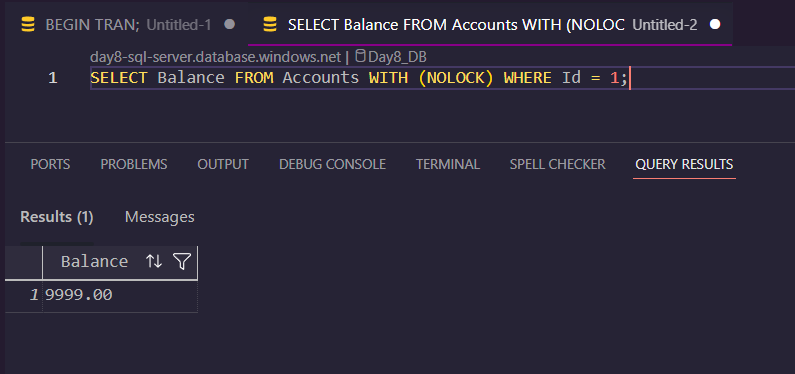
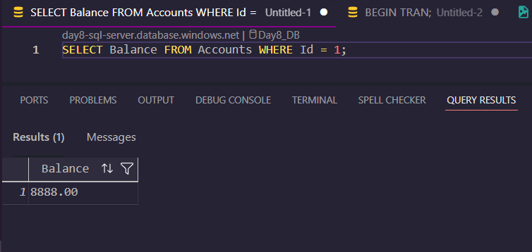
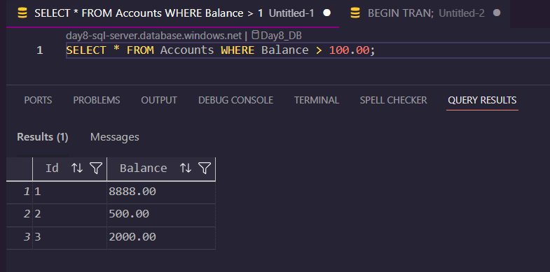

### GitHub link
https://github.com/thinkbridge-thinkschool/thinkschool--PrakharSahu/tree/feature/day9-piece1/Day9/piece1

### Exercise: Read Anomalies & Isolation Levels

#### 1. Dirty Read
*Occurs when a transaction reads data that has been updated by another uncommitted transaction.*

#### 2. Non-Repeatable Read
*Occurs when a transaction reads the same row twice, but gets different data because another transaction modified and committed the row in between reads.*

#### 3. Phantom Read
*Occurs when a transaction re-executes a query returning a set of rows, but finds that a new row was inserted by another committed transaction.*

---

#### Prevention Table

| Anomaly | Lowest Isolation Level That Prevents It |
| :--- | :--- |
| **Dirty Read** | \READ COMMITTED\ |
| **Non-Repeatable Read** | \REPEATABLE READ\ |
| **Phantom Read** | \SERIALIZABLE\ |

### What did you learn this session?
I learned how different transaction isolation levels balance concurrency with data consistency. By default, SQL Server operates at \READ COMMITTED\, which blocks dirty reads but still allows data to change (non-repeatable reads) or new rows to appear (phantoms) during an active transaction. 

### What would break this?
If we blindly applied the \SERIALIZABLE\ isolation level to all transactions in a highly active database, it would break performance. It forces strict range locks, which would lead to massive blocking, deadlocks, and timeouts for concurrent users trying to insert or read data.
