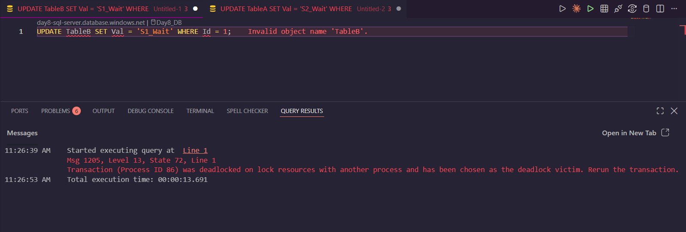

### GitHub link
https://github.com/thinkbridge-thinkschool/thinkschool--PrakharSahu/tree/feature/day9-piece2/Day9/piece2

### Exercise: Reproduce and Resolve a Deadlock

#### The Deadlock Victim Message

#### Repro Scripts (The Cross-Dependency)
**Session 1:**
\\\sql
BEGIN TRAN;
UPDATE TableA SET Val = 'Session1' WHERE Id = 1;
-- (Wait for Session 2 to lock TableB)
UPDATE TableB SET Val = 'S1_Wait' WHERE Id = 1; -- DEADLOCK VICTIM!
\\\

**Session 2:**
\\\sql
BEGIN TRAN;
UPDATE TableB SET Val = 'Session2' WHERE Id = 1;
-- (Wait for Session 1 to block on TableB)
UPDATE TableA SET Val = 'S2_Wait' WHERE Id = 1; 
\\\

#### The Fix (Consistent Lock Ordering)
**Session 1 & Session 2 MUST update in the exact same order (TableA, then TableB).**

**Session 1:**
\\\sql
BEGIN TRAN;
UPDATE TableA SET Val = 'Session1' WHERE Id = 1;
UPDATE TableB SET Val = 'Session1' WHERE Id = 1;
COMMIT;
\\\
**Session 2:**
\\\sql
BEGIN TRAN;
UPDATE TableA SET Val = 'Session2' WHERE Id = 1; -- Will politely wait here for Session 1 to finish
UPDATE TableB SET Val = 'Session2' WHERE Id = 1;
COMMIT;
\\\

**Why it works:** By enforcing a consistent lock acquisition order across all transactions, you eliminate the circular wait condition. One session will simply queue up behind the other, turning a deadlock into a standard, safe block.

### What did you learn this session?
I learned that deadlocks are a logical design issue, not just a random database glitch. They happen when a circular dependency forms between competing transactions. SQL Server resolves this by choosing one transaction to kill (the victim) and rolling it back.

### What would break this?
If a developer introduces a new feature that updates these tables in reverse order (e.g., TableB then TableA) without consulting the established locking hierarchy, the cross-dependency is immediately reintroduced and deadlocks will start crashing the application again.
